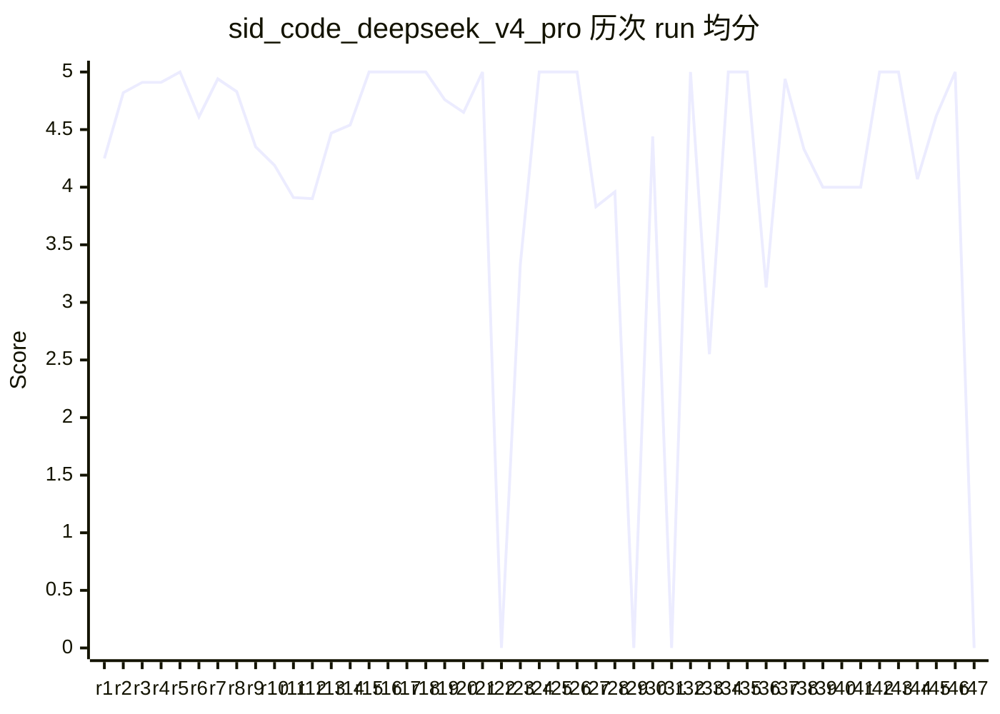

# Evals Dashboard — sid-code

> 自动生成,请勿手动编辑。生成时间: `2026-05-30T13:18:51.348Z`
> 数据源: `evals/p*-*/` + `evals/_scores/` + `evals/_reports/`
> 触发: 手动 `bun run eval:dashboard` / git pre-push hook 自动刷新
> Grader 过滤: **仅 `5d-v4`**（跨 grader 版本总分不可直接比较；切换：`--include-legacy`）

---

## 1. 总览

- **case 总数**: 151 条
- **优先级分布**: P0=71 / P1=72 / P2=8 / holdout=13
- **claude_code** 评分进度: 0/151 已评分 (126 pending, 25 legacy 隐藏)
- **claude_code_claude_opus_4_7** 评分进度: 0/151 已评分 (126 pending, 25 legacy 隐藏)
- **claude_code_opus47** 评分进度: 0/151 已评分 (126 pending, 25 legacy 隐藏)
- **codex** 评分进度: 0/151 已评分 (151 pending)
- **sid_code_claude_opus_4_7** 评分进度: 0/151 已评分 (126 pending, 25 legacy 隐藏)
- **sid_code_deepseek_v4_pro** 评分进度: 34/151 已评分 (67 pending, 50 legacy 隐藏)
- **sid_code_live** 评分进度: 0/151 已评分 (126 pending, 25 legacy 隐藏)
- **sid_code_opus47** 评分进度: 0/151 已评分 (126 pending, 25 legacy 隐藏)
- **sid_code_w0** 评分进度: 0/151 已评分 (139 pending, 12 legacy 隐藏)
- ⚠️ 共隐藏 **212** 条 legacy baseline（非 `5d-v4`）；查看用 `--include-legacy`

### 最新一周: w22

## 1.1 行为分 vs 架构分 双指标

> 行为分 = `evals/general/` 下 5 维 grader 跑出的均分（动态行为评测）
> 架构分 = `evals/architecture/` 下 binary_redline / structured_arch 跑出的均分（静态结构评测 + 红线 binary）
> 两者对应 08 §13.3 双指标：行为分反映 agent 跑事件能力，架构分反映底座完整性

| Tool | 行为分（n） | 架构分（n） | Δ |
| --- | --- | --- | --- |
| claude_code | – | – | – |
| claude_code_claude_opus_4_7 | – | – | – |
| claude_code_opus47 | – | – | – |
| codex | – | – | – |
| sid_code_claude_opus_4_7 | – | – | – |
| sid_code_deepseek_v4_pro | 4.63 (n=25) | 4.63 (n=9) | -0.00 |
| sid_code_live | – | – | – |
| sid_code_opus47 | – | – | – |
| sid_code_w0 | – | – | – |

## 2. Case × Tool 矩阵

图例: ✅ ≥4.5 / 🟢 3.5-4.4 / 🟡 2.5-3.4 / 🟠 1.5-2.4 / 🔴 <1.5 / – pending / ❌ error / ⏱️ timeout / 🕰️ legacy(已过滤)

| case_id | pri | category | claude_code | claude_code_claude_opus_4_7 | claude_code_opus47 | codex | sid_code_claude_opus_4_7 | sid_code_deepseek_v4_pro | sid_code_live | sid_code_opus47 | sid_code_w0 | w22.anchor | w22.llm |
| --- | --- | --- | --- | --- | --- | --- | --- | --- | --- | --- | --- | --- | --- |
| arch_chinese_001 | P0 | 架构中文一等公民 | – | – | – | – | – | 🕰️ | – | – | – | – | – |
| arch_chinese_002 | P0 | 架构中文一等公民 | – | – | – | – | – | 🕰️ | – | – | – | – | – |
| arch_chinese_003 | P0 | 架构中文一等公民 | – | – | – | – | – | 🕰️ | – | – | – | – | – |
| arch_chinese_004 | P0 | 架构中文一等公民 | – | – | – | – | – | 🕰️ | – | – | – | – | – |
| arch_chinese_005 | P0 | 架构中文一等公民 | – | – | – | – | – | 🕰️ | – | – | – | – | – |
| arch_chinese_006 🔒 | P0 | 架构中文一等公民 | – | – | – | – | – | 3.75 🟢 | – | – | – | – | – |
| arch_ctxeng_001 | P0 | 架构 Context Engine | – | – | – | – | – | 🕰️ | – | – | – | – | – |
| arch_ctxeng_002 | P0 | 架构 Context Engine | – | – | – | – | – | 🕰️ | – | – | – | – | – |
| arch_ctxeng_003 | P0 | 架构 Context Engine | – | – | – | – | – | 🕰️ | – | – | – | – | – |
| arch_ctxeng_004 | P0 | 架构 Context Engine | – | – | – | – | – | 🕰️ | – | – | – | – | – |
| arch_ctxeng_005 | P0 | 架构 Context Engine | – | – | – | – | – | 🕰️ | – | – | – | – | – |
| arch_ctxeng_006 | P1 | 架构 Context Engine | – | – | – | – | – | – | – | – | – | – | – |
| arch_ctxeng_007 | P1 | 架构 Context Engine | – | – | – | – | – | – | – | – | – | – | – |
| arch_ctxeng_008 | P1 | 架构 Context Engine | – | – | – | – | – | – | – | – | – | – | – |
| arch_ctxeng_009 | P1 | 架构 Context Engine | – | – | – | – | – | – | – | – | – | – | – |
| arch_ctxeng_010 | P1 | 架构 Context Engine | – | – | – | – | – | – | – | – | – | – | – |
| arch_discipline_001 | P0 | 架构纪律 | – | – | – | – | – | 🕰️ | – | – | – | – | – |
| arch_discipline_002 | P0 | 架构纪律 | – | – | – | – | – | 🕰️ | – | – | – | – | – |
| arch_discipline_003 🔒 | P0 | 架构纪律 | – | – | – | – | – | 3.75 🟢 | – | – | – | – | – |
| arch_discipline_004 | P0 | 架构纪律 | – | – | – | – | – | 🕰️ | – | – | – | – | – |
| arch_durable_001 | P1 | 架构长流程编排 | – | – | – | – | – | – | – | – | – | – | – |
| arch_durable_002 | P1 | 架构长流程编排 | – | – | – | – | – | – | – | – | – | – | – |
| arch_durable_003 | P1 | 架构长流程编排 | – | – | – | – | – | – | – | – | – | – | – |
| arch_durable_004 | P1 | 架构长流程编排 | – | – | – | – | – | – | – | – | – | – | – |
| arch_durable_005 | P1 | 架构长流程编排 | – | – | – | – | – | – | – | – | – | – | – |
| arch_form_001 | P0 | 架构形态 | – | – | – | – | – | 🕰️ | – | – | – | – | – |
| arch_form_002 🔒 | P0 | 架构形态 | – | – | – | – | – | 5 ✅ | – | – | – | – | – |
| arch_form_003 | P0 | 架构形态 | – | – | – | – | – | 🕰️ | – | – | – | – | – |
| arch_form_004 | P0 | 架构形态 | – | – | – | – | – | 🕰️ | – | – | – | – | – |
| arch_form_005 | P0 | 架构形态 | – | – | – | – | – | 🕰️ | – | – | – | – | – |
| arch_kernel_001 | P0 | 架构内核 | – | – | – | – | – | 🕰️ | – | – | – | – | – |
| arch_kernel_002 | P0 | 架构内核 | – | – | – | – | – | 🕰️ | – | – | – | – | – |
| arch_kernel_003 | P0 | 架构内核 | – | – | – | – | – | 🕰️ | – | – | – | – | – |
| arch_kernel_004 | P0 | 架构内核 | – | – | – | – | – | 🕰️ | – | – | – | – | – |
| arch_kernel_005 | P0 | 架构内核 | – | – | – | – | – | 🕰️ | – | – | – | – | – |
| arch_kernel_006 | P0 | 架构内核 | – | – | – | – | – | 🕰️ | – | – | – | – | – |
| arch_kernel_007 | P0 | 架构内核 | – | – | – | – | – | 🕰️ | – | – | – | – | – |
| arch_kernel_008 🔒 | P0 | 架构内核 | – | – | – | – | – | 5 ✅ | – | – | – | – | – |
| arch_meta_001 | P0 | 架构评测自检 | – | – | – | – | – | 🕰️ | – | – | – | – | – |
| arch_meta_002 | P0 | 架构评测自检 | – | – | – | – | – | 🕰️ | – | – | – | – | – |
| arch_meta_003 | P0 | 架构评测自检 | – | – | – | – | – | 🕰️ | – | – | – | – | – |
| arch_meta_004 🔒 | P0 | 架构评测自检 | – | – | – | – | – | 4.17 🟢 | – | – | – | – | – |
| arch_meta_005 🔒 | P0 | 架构评测自检 | – | – | – | – | – | 5 ✅ | – | – | – | – | – |
| arch_milestone_001 | P0 | 架构里程碑 | – | – | – | – | – | – | – | – | – | – | – |
| arch_milestone_002 | P1 | 架构里程碑 | – | – | – | – | – | – | – | – | – | – | – |
| arch_milestone_003 | P1 | 架构里程碑 | – | – | – | – | – | – | – | – | – | – | – |
| arch_nonfunc_001 | P1 | 架构非功能 | – | – | – | – | – | – | – | – | – | – | – |
| arch_nonfunc_002 | P1 | 架构非功能 | – | – | – | – | – | – | – | – | – | – | – |
| arch_nonfunc_003 | P1 | 架构非功能 | – | – | – | – | – | – | – | – | – | – | – |
| arch_nonfunc_004 | P1 | 架构非功能 | – | – | – | – | – | – | – | – | – | – | – |
| arch_nonfunc_005 | P1 | 架构非功能 | – | – | – | – | – | – | – | – | – | – | – |
| arch_nonfunc_006 | P1 | 架构非功能 | – | – | – | – | – | – | – | – | – | – | – |
| arch_nonfunc_007 | P1 | 架构非功能 | – | – | – | – | – | – | – | – | – | – | – |
| arch_nonfunc_008 | P1 | 架构非功能 | – | – | – | – | – | – | – | – | – | – | – |
| arch_nonfunc_009 | P1 | 架构非功能 | – | – | – | – | – | – | – | – | – | – | – |
| arch_nonfunc_010 | P1 | 架构非功能 | – | – | – | – | – | – | – | – | – | – | – |
| arch_notif_001 | P1 | 架构通知协作 | – | – | – | – | – | – | – | – | – | – | – |
| arch_notif_002 | P1 | 架构通知协作 | – | – | – | – | – | – | – | – | – | – | – |
| arch_notif_003 | P1 | 架构通知协作 | – | – | – | – | – | – | – | – | – | – | – |
| arch_ont_001 | P1 | 架构本体论 | – | – | – | – | – | – | – | – | – | – | – |
| arch_ont_002 | P1 | 架构本体论 | – | – | – | – | – | – | – | – | – | – | – |
| arch_ont_003 | P1 | 架构本体论 | – | – | – | – | – | – | – | – | – | – | – |
| arch_ont_004 | P1 | 架构本体论 | – | – | – | – | – | – | – | – | – | – | – |
| arch_ont_005 | P1 | 架构本体论 | – | – | – | – | – | – | – | – | – | – | – |
| arch_ont_006 | P1 | 架构本体论 | – | – | – | – | – | – | – | – | – | – | – |
| arch_ont_007 | P1 | 架构本体论 | – | – | – | – | – | – | – | – | – | – | – |
| arch_ont_008 | P1 | 架构本体论 | – | – | – | – | – | – | – | – | – | – | – |
| arch_ont_009 | P1 | 架构本体论 | – | – | – | – | – | – | – | – | – | – | – |
| arch_ont_010 | P1 | 架构本体论 | – | – | – | – | – | – | – | – | – | – | – |
| arch_ont_011 | P1 | 架构本体论 | – | – | – | – | – | – | – | – | – | – | – |
| arch_orch_001 | P1 | 架构编排 | – | – | – | – | – | – | – | – | – | – | – |
| arch_orch_002 | P1 | 架构编排 | – | – | – | – | – | – | – | – | – | – | – |
| arch_orch_003 | P1 | 架构编排 | – | – | – | – | – | – | – | – | – | – | – |
| arch_orch_004 | P1 | 架构编排 | – | – | – | – | – | – | – | – | – | – | – |
| arch_orch_005 | P1 | 架构编排 | – | – | – | – | – | – | – | – | – | – | – |
| arch_orch_006 | P1 | 架构编排 | – | – | – | – | – | – | – | – | – | – | – |
| arch_orch_007 | P1 | 架构编排 | – | – | – | – | – | – | – | – | – | – | – |
| arch_orch_008 | P1 | 架构编排 | – | – | – | – | – | – | – | – | – | – | – |
| arch_outcome_001 | P1 | 架构北极星 | – | – | – | – | – | – | – | – | – | – | – |
| arch_outcome_002 | P1 | 架构北极星 | – | – | – | – | – | – | – | – | – | – | – |
| arch_outcome_003 | P1 | 架构北极星 | – | – | – | – | – | – | – | – | – | – | – |
| arch_platform_001 | P0 | 架构平台 | – | – | – | – | – | 🕰️ | – | – | – | – | – |
| arch_platform_002 | P0 | 架构平台 | – | – | – | – | – | 🕰️ | – | – | – | – | – |
| arch_platform_003 | P0 | 架构平台 | – | – | – | – | – | 🕰️ | – | – | – | – | – |
| arch_platform_004 | P0 | 架构平台 | – | – | – | – | – | 🕰️ | – | – | – | – | – |
| arch_platform_005 | P0 | 架构平台 | – | – | – | – | – | 🕰️ | – | – | – | – | – |
| arch_platform_006 | P1 | 架构平台 | – | – | – | – | – | 5 ✅ | – | – | – | – | – |
| arch_platform_006 🔒 | P0 | 架构平台 | – | – | – | – | – | 5 ✅ | – | – | – | – | – |
| arch_platform_007 | P1 | 架构平台 | – | – | – | – | – | – | – | – | – | – | – |
| arch_platform_008 | P1 | 架构平台 | – | – | – | – | – | – | – | – | – | – | – |
| arch_platform_009 | P1 | 架构平台 | – | – | – | – | – | – | – | – | – | – | – |
| arch_platform_010 | P1 | 架构平台 | – | – | – | – | – | – | – | – | – | – | – |
| arch_platform_011 | P1 | 架构平台 | – | – | – | – | – | – | – | – | – | – | – |
| arch_platform_012 | P1 | 架构平台 | – | – | – | – | – | – | – | – | – | – | – |
| arch_pluggable_001 | P0 | 架构可拔插 | – | – | – | – | – | 🕰️ | – | – | – | – | – |
| arch_pluggable_002 🔒 | P0 | 架构可拔插 | – | – | – | – | – | 5 ✅ | – | – | – | – | – |
| arch_pluggable_003 | P0 | 架构可拔插 | – | – | – | – | – | 🕰️ | – | – | – | – | – |
| arch_pluggable_004 | P0 | 架构可拔插 | – | – | – | – | – | 🕰️ | – | – | – | – | – |
| arch_pluggable_005 | P0 | 架构可拔插 | – | – | – | – | – | 🕰️ | – | – | – | – | – |
| arch_pluggable_006 | P0 | 架构可拔插 | – | – | – | – | – | 🕰️ | – | – | – | – | – |
| arch_pluggable_007 | P0 | 架构可拔插 | – | – | – | – | – | 🕰️ | – | – | – | – | – |
| arch_redline_001 | P0 | 架构红线 | – | – | – | – | – | 🕰️ | – | – | – | – | – |
| arch_redline_002 | P0 | 架构红线 | – | – | – | – | – | 🕰️ | – | – | – | – | – |
| arch_redline_003 | P0 | 架构红线 | – | – | – | – | – | 🕰️ | – | – | – | – | – |
| arch_redline_004 | P0 | 架构红线 | – | – | – | – | – | 🕰️ | – | – | – | – | – |
| arch_redline_005 | P0 | 架构红线 | – | – | – | – | – | 🕰️ | – | – | – | – | – |
| arch_redline_006 | P0 | 架构红线 | – | – | – | – | – | 🕰️ | – | – | – | – | – |
| arch_redline_007 | P0 | 架构红线 | – | – | – | – | – | 🕰️ | – | – | – | – | – |
| arch_redline_008 | P0 | 架构红线 | – | – | – | – | – | 🕰️ | – | – | – | – | – |
| arch_redline_009 | P0 | 架构红线 | – | – | – | – | – | 🕰️ | – | – | – | – | – |
| arch_redline_011 | P0 | 架构红线 | – | – | – | – | – | 🕰️ | – | – | – | – | – |
| arch_redline_012 | P0 | 架构红线 | – | – | – | – | – | 🕰️ | – | – | – | – | – |
| arch_redline_013 | P0 | 架构红线 | – | – | – | – | – | 🕰️ | – | – | – | – | – |
| arch_render_001 | P1 | 架构渲染 | – | – | – | – | – | – | – | – | – | – | – |
| arch_render_002 | P1 | 架构渲染 | – | – | – | – | – | – | – | – | – | – | – |
| arch_render_003 | P1 | 架构渲染 | – | – | – | – | – | – | – | – | – | – | – |
| arch_ux_001 | P1 | 架构 UX | – | – | – | – | – | – | – | – | – | – | – |
| arch_ux_002 | P1 | 架构 UX | – | – | – | – | – | – | – | – | – | – | – |
| arch_ux_003 | P1 | 架构 UX | – | – | – | – | – | – | – | – | – | – | – |
| arch_ux_004 | P1 | 架构 UX | – | – | – | – | – | – | – | – | – | – | – |
| arch_ux_005 | P1 | 架构 UX | – | – | – | – | – | – | – | – | – | – | – |
| case_001 | P0 | 代码理解 | 🕰️ | 🕰️ | 🕰️ | – | 🕰️ | 5 ✅ | 🕰️ | 🕰️ | 🕰️ | – | – |
| case_002 | P0 | 代码理解 | 🕰️ | 🕰️ | 🕰️ | – | 🕰️ | 5 ✅ | 🕰️ | 🕰️ | 🕰️ | – | – |
| case_003 | P0 | 代码理解 | 🕰️ | 🕰️ | 🕰️ | – | 🕰️ | 5 ✅ | 🕰️ | 🕰️ | 🕰️ | – | – |
| case_004 🔒 | P0 | 代码理解 | – | – | – | – | – | – | – | – | – | – | – |
| case_005 | P0 | bug修复 | 🕰️ | 🕰️ | 🕰️ | – | 🕰️ | 5 ✅ | 🕰️ | 🕰️ | 🕰️ | – | – |
| case_006 | P0 | bug修复 | 🕰️ | 🕰️ | 🕰️ | – | 🕰️ | 5 ✅ | 🕰️ | 🕰️ | 🕰️ | – | – |
| case_007 | P0 | bug修复 | 🕰️ | 🕰️ | 🕰️ | – | 🕰️ | 5 ✅ | 🕰️ | 🕰️ | 🕰️ | – | – |
| case_008 | P0 | 新功能实现 | 🕰️ | 🕰️ | 🕰️ | – | 🕰️ | 2.14 🟠 | 🕰️ | 🕰️ | 🕰️ | – | – |
| case_009 | P0 | 新功能实现 | 🕰️ | 🕰️ | 🕰️ | – | 🕰️ | 5 ✅ | 🕰️ | 🕰️ | 🕰️ | – | – |
| case_010 🔒 | P0 | 文档生成 | – | – | – | – | – | – | – | – | – | – | – |
| case_011 | P1 | 重构 | 🕰️ | 🕰️ | 🕰️ | – | 🕰️ | 5 ✅ | 🕰️ | 🕰️ | – | – | – |
| case_012 | P1 | 重构 | 🕰️ | 🕰️ | 🕰️ | – | 🕰️ | 5 ✅ | 🕰️ | 🕰️ | – | – | – |
| case_013 | P1 | 多文件协调 | 🕰️ | 🕰️ | 🕰️ | – | 🕰️ | 5 ✅ | 🕰️ | 🕰️ | – | – | – |
| case_014 🔒 | P1 | 多文件协调 | – | – | – | – | – | – | – | – | – | – | – |
| case_015 | P1 | 测试编写 | 🕰️ | 🕰️ | 🕰️ | – | 🕰️ | 4.46 🟢 | 🕰️ | 🕰️ | – | – | – |
| case_016 | P1 | 测试编写 | 🕰️ | 🕰️ | 🕰️ | – | 🕰️ | 5 ✅ | 🕰️ | 🕰️ | – | – | – |
| case_017 | P1 | 依赖管理 | 🕰️ | 🕰️ | 🕰️ | – | 🕰️ | 4.58 ✅ | 🕰️ | 🕰️ | – | – | – |
| case_018 | P1 | MCP工具调用 | 🕰️ | 🕰️ | 🕰️ | – | 🕰️ | 5 ✅ | 🕰️ | 🕰️ | – | – | – |
| case_019 | P1 | MCP工具调用 | 🕰️ | 🕰️ | 🕰️ | – | 🕰️ | 4.46 🟢 | 🕰️ | 🕰️ | – | – | – |
| case_020 | P2 | 跨语言 | 🕰️ | 🕰️ | 🕰️ | – | 🕰️ | 5 ✅ | 🕰️ | 🕰️ | 🕰️ | – | – |
| case_021 | P2 | 歧义查询 | 🕰️ | 🕰️ | 🕰️ | – | 🕰️ | 4.73 ✅ | 🕰️ | 🕰️ | 🕰️ | – | – |
| case_022 | P2 | 歧义查询 | 🕰️ | 🕰️ | 🕰️ | – | 🕰️ | 4.79 ✅ | 🕰️ | 🕰️ | 🕰️ | – | – |
| case_023 🔒 | P2 | 对抗性prompt | – | – | – | – | – | – | – | – | – | – | – |
| case_024 | P2 | 超长上下文 | 🕰️ | 🕰️ | 🕰️ | – | 🕰️ | 3 🟡 | 🕰️ | 🕰️ | 🕰️ | – | – |
| case_025 🔒 | P2 | 诚实兜底 | – | – | – | – | – | – | – | – | – | – | – |
| case_026 | P0 | 文档生成 | 🕰️ | 🕰️ | 🕰️ | – | 🕰️ | 5 ✅ | 🕰️ | 🕰️ | – | – | – |
| case_027 | P0 | bug修复 | 🕰️ | 🕰️ | 🕰️ | – | 🕰️ | 5 ✅ | 🕰️ | 🕰️ | – | – | – |
| case_028 | P1 | 多文件协调 | 🕰️ | 🕰️ | 🕰️ | – | 🕰️ | 5 ✅ | 🕰️ | 🕰️ | – | – | – |
| case_029 | P2 | 对抗性prompt | 🕰️ | 🕰️ | 🕰️ | – | 🕰️ | 3.03 🟡 | 🕰️ | 🕰️ | – | – | – |
| case_030 | P2 | 诚实兜底 | 🕰️ | 🕰️ | 🕰️ | – | 🕰️ | 4.58 ✅ | 🕰️ | 🕰️ | – | – | – |

> 🕰️ 共 **212** 格 legacy baseline 被隐藏（grader 版本 ≠ `5d-v4`，跨版本总分不可直接比较）。查看用 `--include-legacy`。

## 3. 单 case 跨周趋势

覆盖周次: w12 ~ w22 (共 3 周)

### 3.1 综合趋势(全 case 均分)

> (无有效分数,跳过图表)

### 3.2 单 case 折线(仅展示有 ≥3 周数据的 case)

> 无 case 满足 ≥3 周数据条件,跳过单 case 折线。

## 4. 运行历史趋势 (per-run)

数据源: `evals/_runs/{provider}.jsonl`（每次 eval-runner 完成自动追加）

### 4.1 sid_code_claude_opus_4_7

总计: 2 次 run × 25 个 case = 30 条记录

**4.x.1 每次 run 的均分趋势**

| run_id (UTC) | cases | avg | pass≥3 | fail<3 | error/timeout |
| --- | --- | --- | --- | --- | --- |
| `2026-05-24 02:59:12` | 5 | **4.64** | 5 | 0 | 0 |
| `2026-05-24 03:23:14` | 25 | **4.86** | 25 | 0 | 0 |

```mermaid
xychart-beta
    title "sid_code_claude_opus_4_7 历次 run 均分"
    x-axis [r1, r2]
    y-axis "Score" 0 --> 5
    line [4.64, 4.86]
```

<sub>fallback 表格 — sid_code_claude_opus_4_7 历次 run 均分</sub>

| 系列 | r1 | r2 |
| --- | --- | --- |
| avg | 4.64 | 4.86 |

**4.x.2 单 case 多次 run 折线** (仅展示 ≥2 次 run 的 case)

<details><summary><code>case_002</code> · 2 次 · 4.65 → 4.65 (Δ 0.00)</summary>

```mermaid
xychart-beta
    title "case_002 历次 run 分数"
    x-axis [r1, r2]
    y-axis "Score" 0 --> 5
    line [4.65, 4.65]
```

<sub>fallback 表格 — case_002 历次 run 分数</sub>

| 系列 | r1 | r2 |
| --- | --- | --- |
| score | 4.65 | 4.65 |

</details>

<details><summary><code>case_005</code> · 2 次 · 4.35 → 4.53 (Δ +0.18)</summary>

```mermaid
xychart-beta
    title "case_005 历次 run 分数"
    x-axis [r1, r2]
    y-axis "Score" 0 --> 5
    line [4.35, 4.53]
```

<sub>fallback 表格 — case_005 历次 run 分数</sub>

| 系列 | r1 | r2 |
| --- | --- | --- |
| score | 4.35 | 4.53 |

</details>

<details><summary><code>case_007</code> · 2 次 · 5.00 → 5.00 (Δ 0.00)</summary>

```mermaid
xychart-beta
    title "case_007 历次 run 分数"
    x-axis [r1, r2]
    y-axis "Score" 0 --> 5
    line [5.00, 5.00]
```

<sub>fallback 表格 — case_007 历次 run 分数</sub>

| 系列 | r1 | r2 |
| --- | --- | --- |
| score | 5.00 | 5.00 |

</details>

<details><summary><code>case_028</code> · 2 次 · 4.65 → 5.00 (Δ +0.35)</summary>

```mermaid
xychart-beta
    title "case_028 历次 run 分数"
    x-axis [r1, r2]
    y-axis "Score" 0 --> 5
    line [4.65, 5.00]
```

<sub>fallback 表格 — case_028 历次 run 分数</sub>

| 系列 | r1 | r2 |
| --- | --- | --- |
| score | 4.65 | 5.00 |

</details>

<details><summary><code>case_030</code> · 2 次 · 4.56 → 4.56 (Δ 0.00)</summary>

```mermaid
xychart-beta
    title "case_030 历次 run 分数"
    x-axis [r1, r2]
    y-axis "Score" 0 --> 5
    line [4.56, 4.56]
```

<sub>fallback 表格 — case_030 历次 run 分数</sub>

| 系列 | r1 | r2 |
| --- | --- | --- |
| score | 4.56 | 4.56 |

</details>

### 4.2 sid_code_deepseek_v4_pro

总计: 47 次 run × 84 个 case = 352 条记录

**4.x.1 每次 run 的均分趋势**

| run_id (UTC) | cases | avg | pass≥3 | fail<3 | error/timeout |
| --- | --- | --- | --- | --- | --- |
| `2026-05-23 17:25:14` | 25 | **4.25** | 23 | 2 | 0 |
| `2026-05-23 17:45:57` | 3 | **4.82** | 3 | 0 | 0 |
| `2026-05-24 13:00:00` | 1 | **4.91** | 1 | 0 | 0 |
| `2026-05-24 13:16:20` | 1 | **4.91** | 1 | 0 | 0 |
| `2026-05-24 16:26:40` | 1 | **5.00** | 1 | 0 | 0 |
| `2026-05-24 16:57:03` | 25 | **4.61** | 23 | 2 | 0 |
| `2026-05-24 17:12:54` | 3 | **4.94** | 3 | 0 | 0 |
| `2026-05-24 17:33:06` | 25 | **4.83** | 25 | 0 | 0 |
| `2026-05-24 18:14:10` | 4 | **4.35** | 4 | 0 | 0 |
| `2026-05-24 18:22:12` | 4 | **4.19** | 3 | 1 | 0 |
| `2026-05-24 18:25:23` | 4 | **3.91** | 2 | 1 | 1 |
| `2026-05-24 18:28:58` | 2 | **3.90** | 2 | 0 | 0 |
| `2026-05-24 18:50:39` | 25 | **4.47** | 23 | 1 | 1 |
| `2026-05-25 02:40:02` | 1 | **4.54** | 1 | 0 | 0 |
| `2026-05-25 02:49:27` | 1 | **5.00** | 1 | 0 | 0 |
| `2026-05-25 02:50:42` | 1 | **5.00** | 1 | 0 | 0 |
| `2026-05-25 02:51:51` | 1 | **5.00** | 1 | 0 | 0 |
| `2026-05-25 03:04:49` | 1 | **5.00** | 1 | 0 | 0 |
| `2026-05-25 20:57:18` | 25 | **4.76** | 24 | 1 | 0 |
| `2026-05-27 16:03:54` | 25 | **4.65** | 24 | 1 | 0 |
| `2026-05-27 19:31:00` | 1 | **5.00** | 1 | 0 | 0 |
| `2026-05-27 19:32:09` | 1 | **0.00** | 0 | 0 | 0 |
| `2026-05-27 19:44:09` | 12 | **3.33** | 8 | 4 | 0 |
| `2026-05-27 20:05:45` | 4 | **5.00** | 3 | 0 | 1 |
| `2026-05-27 20:09:36` | 1 | **5.00** | 1 | 0 | 0 |
| `2026-05-28 01:53:49` | 8 | **5.00** | 8 | 0 | 0 |
| `2026-05-28 02:00:07` | 5 | **3.83** | 3 | 2 | 0 |
| `2026-05-28 02:16:34` | 53 | **3.96** | 28 | 8 | 17 |
| `2026-05-28 02:19:53` | 1 | **0.00** | 0 | 0 | 1 |
| `2026-05-28 02:38:30` | 18 | **4.44** | 16 | 2 | 0 |
| `2026-05-28 02:40:44` | 1 | **0.00** | 0 | 1 | 0 |
| `2026-05-28 02:41:40` | 1 | **5.00** | 1 | 0 | 0 |
| `2026-05-28 03:04:38` | 5 | **2.55** | 3 | 2 | 0 |
| `2026-05-28 03:14:08` | 3 | **5.00** | 3 | 0 | 0 |
| `2026-05-28 03:30:07` | 3 | **5.00** | 1 | 0 | 2 |
| `2026-05-28 03:42:22` | 3 | **3.13** | 2 | 1 | 0 |
| `2026-05-28 03:48:03` | 11 | **4.94** | 9 | 0 | 2 |
| `2026-05-28 03:58:41` | 3 | **4.33** | 3 | 0 | 0 |
| `2026-05-28 04:00:23` | 1 | **4.00** | 1 | 0 | 0 |
| `2026-05-28 04:00:51` | 1 | **4.00** | 1 | 0 | 0 |
| `2026-05-28 04:01:28` | 1 | **4.00** | 1 | 0 | 0 |
| `2026-05-28 04:19:38` | 1 | **5.00** | 1 | 0 | 0 |
| `2026-05-29 18:41:58` | 1 | **5.00** | 1 | 0 | 0 |
| `2026-05-29 19:15:46` | 9 | **4.07** | 8 | 1 | 0 |
| `2026-05-29 19:21:23` | 24 | **4.62** | 23 | 1 | 0 |
| `2026-05-29 20:26:55` | 1 | **5.00** | 1 | 0 | 0 |
| `2026-05-30 02:52:39` | 1 | **0.00** | 0 | 1 | 0 |



<sub>fallback 表格 — sid_code_deepseek_v4_pro 历次 run 均分</sub>

| 系列 | r1 | r2 | r3 | r4 | r5 | r6 | r7 | r8 | r9 | r10 | r11 | r12 | r13 | r14 | r15 | r16 | r17 | r18 | r19 | r20 | r21 | r22 | r23 | r24 | r25 | r26 | r27 | r28 | r29 | r30 | r31 | r32 | r33 | r34 | r35 | r36 | r37 | r38 | r39 | r40 | r41 | r42 | r43 | r44 | r45 | r46 | r47 |
| --- | --- | --- | --- | --- | --- | --- | --- | --- | --- | --- | --- | --- | --- | --- | --- | --- | --- | --- | --- | --- | --- | --- | --- | --- | --- | --- | --- | --- | --- | --- | --- | --- | --- | --- | --- | --- | --- | --- | --- | --- | --- | --- | --- | --- | --- | --- | --- |
| avg | 4.25 | 4.82 | 4.91 | 4.91 | 5.00 | 4.61 | 4.94 | 4.83 | 4.35 | 4.19 | 3.91 | 3.90 | 4.47 | 4.54 | 5.00 | 5.00 | 5.00 | 5.00 | 4.76 | 4.65 | 5.00 | 0.00 | 3.33 | 5.00 | 5.00 | 5.00 | 3.83 | 3.96 | 0.00 | 4.44 | 0.00 | 5.00 | 2.55 | 5.00 | 5.00 | 3.13 | 4.94 | 4.33 | 4.00 | 4.00 | 4.00 | 5.00 | 5.00 | 4.07 | 4.62 | 5.00 | 0.00 |

**4.x.2 单 case 多次 run 折线** (仅展示 ≥2 次 run 的 case)

<details><summary><code>arch_form_001</code> · 2 次 · 5.00 → 5.00 (Δ 0.00)</summary>

```mermaid
xychart-beta
    title "arch_form_001 历次 run 分数"
    x-axis [r1, r2]
    y-axis "Score" 0 --> 5
    line [5.00, 5.00]
```

<sub>fallback 表格 — arch_form_001 历次 run 分数</sub>

| 系列 | r1 | r2 |
| --- | --- | --- |
| score | 5.00 | 5.00 |

</details>

<details><summary><code>arch_form_002</code> · 2 次 · 5.00 → 5.00 (Δ 0.00)</summary>

```mermaid
xychart-beta
    title "arch_form_002 历次 run 分数"
    x-axis [r1, r2]
    y-axis "Score" 0 --> 5
    line [5.00, 5.00]
```

<sub>fallback 表格 — arch_form_002 历次 run 分数</sub>

| 系列 | r1 | r2 |
| --- | --- | --- |
| score | 5.00 | 5.00 |

</details>

<details><summary><code>arch_form_003</code> · 2 次 · 2.50 → 2.50 (Δ 0.00)</summary>

```mermaid
xychart-beta
    title "arch_form_003 历次 run 分数"
    x-axis [r1, r2]
    y-axis "Score" 0 --> 5
    line [2.50, 2.50]
```

<sub>fallback 表格 — arch_form_003 历次 run 分数</sub>

| 系列 | r1 | r2 |
| --- | --- | --- |
| score | 2.50 | 2.50 |

</details>

<details><summary><code>arch_form_004</code> · 2 次 · 1.67 → 1.67 (Δ 0.00)</summary>

```mermaid
xychart-beta
    title "arch_form_004 历次 run 分数"
    x-axis [r1, r2]
    y-axis "Score" 0 --> 5
    line [1.67, 1.67]
```

<sub>fallback 表格 — arch_form_004 历次 run 分数</sub>

| 系列 | r1 | r2 |
| --- | --- | --- |
| score | 1.67 | 1.67 |

</details>

<details><summary><code>arch_form_005</code> · 2 次 · 5.00 → 5.00 (Δ 0.00)</summary>

```mermaid
xychart-beta
    title "arch_form_005 历次 run 分数"
    x-axis [r1, r2]
    y-axis "Score" 0 --> 5
    line [5.00, 5.00]
```

<sub>fallback 表格 — arch_form_005 历次 run 分数</sub>

| 系列 | r1 | r2 |
| --- | --- | --- |
| score | 5.00 | 5.00 |

</details>

<details><summary><code>arch_kernel_001</code> · 2 次 · 5.00 → 5.00 (Δ 0.00)</summary>

```mermaid
xychart-beta
    title "arch_kernel_001 历次 run 分数"
    x-axis [r1, r2]
    y-axis "Score" 0 --> 5
    line [5.00, 5.00]
```

<sub>fallback 表格 — arch_kernel_001 历次 run 分数</sub>

| 系列 | r1 | r2 |
| --- | --- | --- |
| score | 5.00 | 5.00 |

</details>

<details><summary><code>arch_kernel_002</code> · 2 次 · 5.00 → 5.00 (Δ 0.00)</summary>

```mermaid
xychart-beta
    title "arch_kernel_002 历次 run 分数"
    x-axis [r1, r2]
    y-axis "Score" 0 --> 5
    line [5.00, 5.00]
```

<sub>fallback 表格 — arch_kernel_002 历次 run 分数</sub>

| 系列 | r1 | r2 |
| --- | --- | --- |
| score | 5.00 | 5.00 |

</details>

<details><summary><code>arch_kernel_003</code> · 2 次 · 5.00 → 5.00 (Δ 0.00)</summary>

```mermaid
xychart-beta
    title "arch_kernel_003 历次 run 分数"
    x-axis [r1, r2]
    y-axis "Score" 0 --> 5
    line [5.00, 5.00]
```

<sub>fallback 表格 — arch_kernel_003 历次 run 分数</sub>

| 系列 | r1 | r2 |
| --- | --- | --- |
| score | 5.00 | 5.00 |

</details>

<details><summary><code>arch_kernel_004</code> · 2 次 · 5.00 → 5.00 (Δ 0.00)</summary>

```mermaid
xychart-beta
    title "arch_kernel_004 历次 run 分数"
    x-axis [r1, r2]
    y-axis "Score" 0 --> 5
    line [5.00, 5.00]
```

<sub>fallback 表格 — arch_kernel_004 历次 run 分数</sub>

| 系列 | r1 | r2 |
| --- | --- | --- |
| score | 5.00 | 5.00 |

</details>

<details><summary><code>arch_kernel_005</code> · 2 次 · 5.00 → 5.00 (Δ 0.00)</summary>

```mermaid
xychart-beta
    title "arch_kernel_005 历次 run 分数"
    x-axis [r1, r2]
    y-axis "Score" 0 --> 5
    line [5.00, 5.00]
```

<sub>fallback 表格 — arch_kernel_005 历次 run 分数</sub>

| 系列 | r1 | r2 |
| --- | --- | --- |
| score | 5.00 | 5.00 |

</details>

<details><summary><code>arch_kernel_006</code> · 2 次 · 5.00 → 5.00 (Δ 0.00)</summary>

```mermaid
xychart-beta
    title "arch_kernel_006 历次 run 分数"
    x-axis [r1, r2]
    y-axis "Score" 0 --> 5
    line [5.00, 5.00]
```

<sub>fallback 表格 — arch_kernel_006 历次 run 分数</sub>

| 系列 | r1 | r2 |
| --- | --- | --- |
| score | 5.00 | 5.00 |

</details>

<details><summary><code>arch_kernel_007</code> · 2 次 · 5.00 → 5.00 (Δ 0.00)</summary>

```mermaid
xychart-beta
    title "arch_kernel_007 历次 run 分数"
    x-axis [r1, r2]
    y-axis "Score" 0 --> 5
    line [5.00, 5.00]
```

<sub>fallback 表格 — arch_kernel_007 历次 run 分数</sub>

| 系列 | r1 | r2 |
| --- | --- | --- |
| score | 5.00 | 5.00 |

</details>

<details><summary><code>arch_kernel_008</code> · 2 次 · 5.00 → 5.00 (Δ 0.00)</summary>

```mermaid
xychart-beta
    title "arch_kernel_008 历次 run 分数"
    x-axis [r1, r2]
    y-axis "Score" 0 --> 5
    line [5.00, 5.00]
```

<sub>fallback 表格 — arch_kernel_008 历次 run 分数</sub>

| 系列 | r1 | r2 |
| --- | --- | --- |
| score | 5.00 | 5.00 |

</details>

<details><summary><code>arch_meta_001</code> · 2 次 · – → 4.38 (Δ –)</summary>

```mermaid
xychart-beta
    title "arch_meta_001 历次 run 分数"
    x-axis [r1, r2]
    y-axis "Score" 0 --> 5
    line [0, 4.38]
```

<sub>fallback 表格 — arch_meta_001 历次 run 分数</sub>

| 系列 | r1 | r2 |
| --- | --- | --- |
| score | – | 4.38 |

</details>

<details><summary><code>arch_meta_002</code> · 2 次 · 5.00 → 0.00 (Δ -5.00)</summary>

```mermaid
xychart-beta
    title "arch_meta_002 历次 run 分数"
    x-axis [r1, r2]
    y-axis "Score" 0 --> 5
    line [5.00, 0.00]
```

<sub>fallback 表格 — arch_meta_002 历次 run 分数</sub>

| 系列 | r1 | r2 |
| --- | --- | --- |
| score | 5.00 | 0.00 |

</details>

<details><summary><code>arch_meta_003</code> · 2 次 · – → 5.00 (Δ –)</summary>

```mermaid
xychart-beta
    title "arch_meta_003 历次 run 分数"
    x-axis [r1, r2]
    y-axis "Score" 0 --> 5
    line [0, 5.00]
```

<sub>fallback 表格 — arch_meta_003 历次 run 分数</sub>

| 系列 | r1 | r2 |
| --- | --- | --- |
| score | – | 5.00 |

</details>

<details><summary><code>arch_platform_001</code> · 6 次 · 3.75 → 3.00 → 4.00 → 4.00 → 4.00 → 5.00 (Δ +1.25)</summary>

```mermaid
xychart-beta
    title "arch_platform_001 历次 run 分数"
    x-axis [r1, r2, r3, r4, r5, r6]
    y-axis "Score" 0 --> 5
    line [3.75, 3.00, 4.00, 4.00, 4.00, 5.00]
```

<sub>fallback 表格 — arch_platform_001 历次 run 分数</sub>

| 系列 | r1 | r2 | r3 | r4 | r5 | r6 |
| --- | --- | --- | --- | --- | --- | --- |
| score | 3.75 | 3.00 | 4.00 | 4.00 | 4.00 | 5.00 |

</details>

<details><summary><code>arch_platform_006</code> · 2 次 · 0.00 → 5.00 (Δ +5.00)</summary>

```mermaid
xychart-beta
    title "arch_platform_006 历次 run 分数"
    x-axis [r1, r2]
    y-axis "Score" 0 --> 5
    line [0.00, 5.00]
```

<sub>fallback 表格 — arch_platform_006 历次 run 分数</sub>

| 系列 | r1 | r2 |
| --- | --- | --- |
| score | 0.00 | 5.00 |

</details>

<details><summary><code>arch_pluggable_004</code> · 2 次 · – → 5.00 (Δ –)</summary>

```mermaid
xychart-beta
    title "arch_pluggable_004 历次 run 分数"
    x-axis [r1, r2]
    y-axis "Score" 0 --> 5
    line [0, 5.00]
```

<sub>fallback 表格 — arch_pluggable_004 历次 run 分数</sub>

| 系列 | r1 | r2 |
| --- | --- | --- |
| score | – | 5.00 |

</details>

<details><summary><code>arch_pluggable_005</code> · 2 次 · – → 5.00 (Δ –)</summary>

```mermaid
xychart-beta
    title "arch_pluggable_005 历次 run 分数"
    x-axis [r1, r2]
    y-axis "Score" 0 --> 5
    line [0, 5.00]
```

<sub>fallback 表格 — arch_pluggable_005 历次 run 分数</sub>

| 系列 | r1 | r2 |
| --- | --- | --- |
| score | – | 5.00 |

</details>

<details><summary><code>arch_redline_001</code> · 3 次 · – → 5.00 → 5.00 (Δ 0.00)</summary>

```mermaid
xychart-beta
    title "arch_redline_001 历次 run 分数"
    x-axis [r1, r2, r3]
    y-axis "Score" 0 --> 5
    line [0, 5.00, 5.00]
```

<sub>fallback 表格 — arch_redline_001 历次 run 分数</sub>

| 系列 | r1 | r2 | r3 |
| --- | --- | --- | --- |
| score | – | 5.00 | 5.00 |

</details>

<details><summary><code>arch_redline_002</code> · 3 次 · 0.00 → 5.00 → 5.00 (Δ +5.00)</summary>

```mermaid
xychart-beta
    title "arch_redline_002 历次 run 分数"
    x-axis [r1, r2, r3]
    y-axis "Score" 0 --> 5
    line [0.00, 5.00, 5.00]
```

<sub>fallback 表格 — arch_redline_002 历次 run 分数</sub>

| 系列 | r1 | r2 | r3 |
| --- | --- | --- | --- |
| score | 0.00 | 5.00 | 5.00 |

</details>

<details><summary><code>arch_redline_003</code> · 5 次 · 5.00 → 0.00 → 0.00 → 0.00 → 5.00 (Δ 0.00)</summary>

```mermaid
xychart-beta
    title "arch_redline_003 历次 run 分数"
    x-axis [r1, r2, r3, r4, r5]
    y-axis "Score" 0 --> 5
    line [5.00, 0.00, 0.00, 0.00, 5.00]
```

<sub>fallback 表格 — arch_redline_003 历次 run 分数</sub>

| 系列 | r1 | r2 | r3 | r4 | r5 |
| --- | --- | --- | --- | --- | --- |
| score | 5.00 | 0.00 | 0.00 | 0.00 | 5.00 |

</details>

<details><summary><code>arch_redline_004</code> · 2 次 · 5.00 → 5.00 (Δ 0.00)</summary>

```mermaid
xychart-beta
    title "arch_redline_004 历次 run 分数"
    x-axis [r1, r2]
    y-axis "Score" 0 --> 5
    line [5.00, 5.00]
```

<sub>fallback 表格 — arch_redline_004 历次 run 分数</sub>

| 系列 | r1 | r2 |
| --- | --- | --- |
| score | 5.00 | 5.00 |

</details>

<details><summary><code>arch_redline_005</code> · 2 次 · 5.00 → 5.00 (Δ 0.00)</summary>

```mermaid
xychart-beta
    title "arch_redline_005 历次 run 分数"
    x-axis [r1, r2]
    y-axis "Score" 0 --> 5
    line [5.00, 5.00]
```

<sub>fallback 表格 — arch_redline_005 历次 run 分数</sub>

| 系列 | r1 | r2 |
| --- | --- | --- |
| score | 5.00 | 5.00 |

</details>

<details><summary><code>arch_redline_006</code> · 2 次 · 5.00 → 5.00 (Δ 0.00)</summary>

```mermaid
xychart-beta
    title "arch_redline_006 历次 run 分数"
    x-axis [r1, r2]
    y-axis "Score" 0 --> 5
    line [5.00, 5.00]
```

<sub>fallback 表格 — arch_redline_006 历次 run 分数</sub>

| 系列 | r1 | r2 |
| --- | --- | --- |
| score | 5.00 | 5.00 |

</details>

<details><summary><code>arch_redline_007</code> · 2 次 · 5.00 → 5.00 (Δ 0.00)</summary>

```mermaid
xychart-beta
    title "arch_redline_007 历次 run 分数"
    x-axis [r1, r2]
    y-axis "Score" 0 --> 5
    line [5.00, 5.00]
```

<sub>fallback 表格 — arch_redline_007 历次 run 分数</sub>

| 系列 | r1 | r2 |
| --- | --- | --- |
| score | 5.00 | 5.00 |

</details>

<details><summary><code>arch_redline_008</code> · 3 次 · 0.00 → 5.00 → 5.00 (Δ +5.00)</summary>

```mermaid
xychart-beta
    title "arch_redline_008 历次 run 分数"
    x-axis [r1, r2, r3]
    y-axis "Score" 0 --> 5
    line [0.00, 5.00, 5.00]
```

<sub>fallback 表格 — arch_redline_008 历次 run 分数</sub>

| 系列 | r1 | r2 | r3 |
| --- | --- | --- | --- |
| score | 0.00 | 5.00 | 5.00 |

</details>

<details><summary><code>arch_redline_009</code> · 3 次 · 0.00 → 5.00 → 5.00 (Δ +5.00)</summary>

```mermaid
xychart-beta
    title "arch_redline_009 历次 run 分数"
    x-axis [r1, r2, r3]
    y-axis "Score" 0 --> 5
    line [0.00, 5.00, 5.00]
```

<sub>fallback 表格 — arch_redline_009 历次 run 分数</sub>

| 系列 | r1 | r2 | r3 |
| --- | --- | --- | --- |
| score | 0.00 | 5.00 | 5.00 |

</details>

<details><summary><code>arch_redline_011</code> · 3 次 · 5.00 → 5.00 → 5.00 (Δ 0.00)</summary>

```mermaid
xychart-beta
    title "arch_redline_011 历次 run 分数"
    x-axis [r1, r2, r3]
    y-axis "Score" 0 --> 5
    line [5.00, 5.00, 5.00]
```

<sub>fallback 表格 — arch_redline_011 历次 run 分数</sub>

| 系列 | r1 | r2 | r3 |
| --- | --- | --- | --- |
| score | 5.00 | 5.00 | 5.00 |

</details>

<details><summary><code>arch_redline_012</code> · 2 次 · 5.00 → 5.00 (Δ 0.00)</summary>

```mermaid
xychart-beta
    title "arch_redline_012 历次 run 分数"
    x-axis [r1, r2]
    y-axis "Score" 0 --> 5
    line [5.00, 5.00]
```

<sub>fallback 表格 — arch_redline_012 历次 run 分数</sub>

| 系列 | r1 | r2 |
| --- | --- | --- |
| score | 5.00 | 5.00 |

</details>

<details><summary><code>arch_redline_013</code> · 4 次 · 0.00 → – → 5.00 → 5.00 (Δ +5.00)</summary>

```mermaid
xychart-beta
    title "arch_redline_013 历次 run 分数"
    x-axis [r1, r2, r3, r4]
    y-axis "Score" 0 --> 5
    line [0.00, 0, 5.00, 5.00]
```

<sub>fallback 表格 — arch_redline_013 历次 run 分数</sub>

| 系列 | r1 | r2 | r3 | r4 |
| --- | --- | --- | --- | --- |
| score | 0.00 | – | 5.00 | 5.00 |

</details>

<details><summary><code>case_001</code> · 11 次 · 4.35 → 4.65 → 4.65 → 4.44 → 5.00 → 5.00 → 4.57 → 5.00 → 5.00 → 5.00 → 5.00 (Δ +0.65)</summary>

```mermaid
xychart-beta
    title "case_001 历次 run 分数"
    x-axis [r1, r2, r3, r4, r5, r6, r7, r8, r9, r10, r11]
    y-axis "Score" 0 --> 5
    line [4.35, 4.65, 4.65, 4.44, 5.00, 5.00, 4.57, 5.00, 5.00, 5.00, 5.00]
```

<sub>fallback 表格 — case_001 历次 run 分数</sub>

| 系列 | r1 | r2 | r3 | r4 | r5 | r6 | r7 | r8 | r9 | r10 | r11 |
| --- | --- | --- | --- | --- | --- | --- | --- | --- | --- | --- | --- |
| score | 4.35 | 4.65 | 4.65 | 4.44 | 5.00 | 5.00 | 4.57 | 5.00 | 5.00 | 5.00 | 5.00 |

</details>

<details><summary><code>case_002</code> · 14 次 · 4.56 → 5.00 → 4.65 → 5.00 → 4.44 → 4.79 → 4.44 → 4.79 → 5.00 → 5.00 → 5.00 → 5.00 → 5.00 → 5.00 (Δ +0.44)</summary>

```mermaid
xychart-beta
    title "case_002 历次 run 分数"
    x-axis [r1, r2, r3, r4, r5, r6, r7, r8, r9, r10, r11, r12, r13, r14]
    y-axis "Score" 0 --> 5
    line [4.56, 5.00, 4.65, 5.00, 4.44, 4.79, 4.44, 4.79, 5.00, 5.00, 5.00, 5.00, 5.00, 5.00]
```

<sub>fallback 表格 — case_002 历次 run 分数</sub>

| 系列 | r1 | r2 | r3 | r4 | r5 | r6 | r7 | r8 | r9 | r10 | r11 | r12 | r13 | r14 |
| --- | --- | --- | --- | --- | --- | --- | --- | --- | --- | --- | --- | --- | --- | --- |
| score | 4.56 | 5.00 | 4.65 | 5.00 | 4.44 | 4.79 | 4.44 | 4.79 | 5.00 | 5.00 | 5.00 | 5.00 | 5.00 | 5.00 |

</details>

<details><summary><code>case_003</code> · 8 次 · 4.29 → 5.00 → 5.00 → 4.79 → 5.00 → 5.00 → 5.00 → 5.00 (Δ +0.71)</summary>

```mermaid
xychart-beta
    title "case_003 历次 run 分数"
    x-axis [r1, r2, r3, r4, r5, r6, r7, r8]
    y-axis "Score" 0 --> 5
    line [4.29, 5.00, 5.00, 4.79, 5.00, 5.00, 5.00, 5.00]
```

<sub>fallback 表格 — case_003 历次 run 分数</sub>

| 系列 | r1 | r2 | r3 | r4 | r5 | r6 | r7 | r8 |
| --- | --- | --- | --- | --- | --- | --- | --- | --- |
| score | 4.29 | 5.00 | 5.00 | 4.79 | 5.00 | 5.00 | 5.00 | 5.00 |

</details>

<details><summary><code>case_005</code> · 10 次 · 4.12 → 4.71 → 4.71 → – → 5.00 → 5.00 → – → – → 5.00 → 5.00 (Δ +0.88)</summary>

```mermaid
xychart-beta
    title "case_005 历次 run 分数"
    x-axis [r1, r2, r3, r4, r5, r6, r7, r8, r9, r10]
    y-axis "Score" 0 --> 5
    line [4.12, 4.71, 4.71, 0, 5.00, 5.00, 0, 0, 5.00, 5.00]
```

<sub>fallback 表格 — case_005 历次 run 分数</sub>

| 系列 | r1 | r2 | r3 | r4 | r5 | r6 | r7 | r8 | r9 | r10 |
| --- | --- | --- | --- | --- | --- | --- | --- | --- | --- | --- |
| score | 4.12 | 4.71 | 4.71 | – | 5.00 | 5.00 | – | – | 5.00 | 5.00 |

</details>

<details><summary><code>case_006</code> · 8 次 · 3.87 → 4.56 → 4.71 → 4.72 → 5.00 → 5.00 → 4.46 → 5.00 (Δ +1.13)</summary>

```mermaid
xychart-beta
    title "case_006 历次 run 分数"
    x-axis [r1, r2, r3, r4, r5, r6, r7, r8]
    y-axis "Score" 0 --> 5
    line [3.87, 4.56, 4.71, 4.72, 5.00, 5.00, 4.46, 5.00]
```

<sub>fallback 表格 — case_006 历次 run 分数</sub>

| 系列 | r1 | r2 | r3 | r4 | r5 | r6 | r7 | r8 |
| --- | --- | --- | --- | --- | --- | --- | --- | --- |
| score | 3.87 | 4.56 | 4.71 | 4.72 | 5.00 | 5.00 | 4.46 | 5.00 |

</details>

<details><summary><code>case_007</code> · 9 次 · 4.56 → 4.47 → 5.00 → 5.00 → 4.72 → 5.00 → 5.00 → 5.00 → 5.00 (Δ +0.44)</summary>

```mermaid
xychart-beta
    title "case_007 历次 run 分数"
    x-axis [r1, r2, r3, r4, r5, r6, r7, r8, r9]
    y-axis "Score" 0 --> 5
    line [4.56, 4.47, 5.00, 5.00, 4.72, 5.00, 5.00, 5.00, 5.00]
```

<sub>fallback 表格 — case_007 历次 run 分数</sub>

| 系列 | r1 | r2 | r3 | r4 | r5 | r6 | r7 | r8 | r9 |
| --- | --- | --- | --- | --- | --- | --- | --- | --- | --- |
| score | 4.56 | 4.47 | 5.00 | 5.00 | 4.72 | 5.00 | 5.00 | 5.00 | 5.00 |

</details>

<details><summary><code>case_008</code> · 8 次 · 4.91 → 5.00 → 5.00 → 3.26 → 5.00 → 5.00 → 5.00 → 2.14 (Δ -2.77)</summary>

```mermaid
xychart-beta
    title "case_008 历次 run 分数"
    x-axis [r1, r2, r3, r4, r5, r6, r7, r8]
    y-axis "Score" 0 --> 5
    line [4.91, 5.00, 5.00, 3.26, 5.00, 5.00, 5.00, 2.14]
```

<sub>fallback 表格 — case_008 历次 run 分数</sub>

| 系列 | r1 | r2 | r3 | r4 | r5 | r6 | r7 | r8 |
| --- | --- | --- | --- | --- | --- | --- | --- | --- |
| score | 4.91 | 5.00 | 5.00 | 3.26 | 5.00 | 5.00 | 5.00 | 2.14 |

</details>

<details><summary><code>case_009</code> · 9 次 · 4.06 → 4.88 → 4.82 → 4.72 → 5.00 → 5.00 → – → 5.00 → 5.00 (Δ +0.94)</summary>

```mermaid
xychart-beta
    title "case_009 历次 run 分数"
    x-axis [r1, r2, r3, r4, r5, r6, r7, r8, r9]
    y-axis "Score" 0 --> 5
    line [4.06, 4.88, 4.82, 4.72, 5.00, 5.00, 0, 5.00, 5.00]
```

<sub>fallback 表格 — case_009 历次 run 分数</sub>

| 系列 | r1 | r2 | r3 | r4 | r5 | r6 | r7 | r8 | r9 |
| --- | --- | --- | --- | --- | --- | --- | --- | --- | --- |
| score | 4.06 | 4.88 | 4.82 | 4.72 | 5.00 | 5.00 | – | 5.00 | 5.00 |

</details>

<details><summary><code>case_011</code> · 9 次 · 4.91 → 5.00 → 5.00 → 5.00 → 4.91 → 5.00 → 5.00 → 5.00 → 5.00 (Δ +0.09)</summary>

```mermaid
xychart-beta
    title "case_011 历次 run 分数"
    x-axis [r1, r2, r3, r4, r5, r6, r7, r8, r9]
    y-axis "Score" 0 --> 5
    line [4.91, 5.00, 5.00, 5.00, 4.91, 5.00, 5.00, 5.00, 5.00]
```

<sub>fallback 表格 — case_011 历次 run 分数</sub>

| 系列 | r1 | r2 | r3 | r4 | r5 | r6 | r7 | r8 | r9 |
| --- | --- | --- | --- | --- | --- | --- | --- | --- | --- |
| score | 4.91 | 5.00 | 5.00 | 5.00 | 4.91 | 5.00 | 5.00 | 5.00 | 5.00 |

</details>

<details><summary><code>case_012</code> · 8 次 · 4.29 → 4.44 → 4.71 → 2.97 → 4.46 → 3.93 → 3.93 → 5.00 (Δ +0.71)</summary>

```mermaid
xychart-beta
    title "case_012 历次 run 分数"
    x-axis [r1, r2, r3, r4, r5, r6, r7, r8]
    y-axis "Score" 0 --> 5
    line [4.29, 4.44, 4.71, 2.97, 4.46, 3.93, 3.93, 5.00]
```

<sub>fallback 表格 — case_012 历次 run 分数</sub>

| 系列 | r1 | r2 | r3 | r4 | r5 | r6 | r7 | r8 |
| --- | --- | --- | --- | --- | --- | --- | --- | --- |
| score | 4.29 | 4.44 | 4.71 | 2.97 | 4.46 | 3.93 | 3.93 | 5.00 |

</details>

<details><summary><code>case_013</code> · 9 次 · 4.56 → 5.00 → 5.00 → 4.56 → 5.00 → 5.00 → – → 5.00 → 5.00 (Δ +0.44)</summary>

```mermaid
xychart-beta
    title "case_013 历次 run 分数"
    x-axis [r1, r2, r3, r4, r5, r6, r7, r8, r9]
    y-axis "Score" 0 --> 5
    line [4.56, 5.00, 5.00, 4.56, 5.00, 5.00, 0, 5.00, 5.00]
```

<sub>fallback 表格 — case_013 历次 run 分数</sub>

| 系列 | r1 | r2 | r3 | r4 | r5 | r6 | r7 | r8 | r9 |
| --- | --- | --- | --- | --- | --- | --- | --- | --- | --- |
| score | 4.56 | 5.00 | 5.00 | 4.56 | 5.00 | 5.00 | – | 5.00 | 5.00 |

</details>

<details><summary><code>case_015</code> · 13 次 · 4.18 → 4.88 → 3.35 → 3.68 → 2.74 → 2.50 → 3.18 → 4.25 → 2.46 → 4.46 → – → 2.46 → 4.46 (Δ +0.28)</summary>

```mermaid
xychart-beta
    title "case_015 历次 run 分数"
    x-axis [r1, r2, r3, r4, r5, r6, r7, r8, r9, r10, r11, r12, r13]
    y-axis "Score" 0 --> 5
    line [4.18, 4.88, 3.35, 3.68, 2.74, 2.50, 3.18, 4.25, 2.46, 4.46, 0, 2.46, 4.46]
```

<sub>fallback 表格 — case_015 历次 run 分数</sub>

| 系列 | r1 | r2 | r3 | r4 | r5 | r6 | r7 | r8 | r9 | r10 | r11 | r12 | r13 |
| --- | --- | --- | --- | --- | --- | --- | --- | --- | --- | --- | --- | --- | --- |
| score | 4.18 | 4.88 | 3.35 | 3.68 | 2.74 | 2.50 | 3.18 | 4.25 | 2.46 | 4.46 | – | 2.46 | 4.46 |

</details>

<details><summary><code>case_016</code> · 9 次 · 4.35 → 4.88 → 4.88 → 4.72 → 5.00 → 4.46 → – → 5.00 → 5.00 (Δ +0.65)</summary>

```mermaid
xychart-beta
    title "case_016 历次 run 分数"
    x-axis [r1, r2, r3, r4, r5, r6, r7, r8, r9]
    y-axis "Score" 0 --> 5
    line [4.35, 4.88, 4.88, 4.72, 5.00, 4.46, 0, 5.00, 5.00]
```

<sub>fallback 表格 — case_016 历次 run 分数</sub>

| 系列 | r1 | r2 | r3 | r4 | r5 | r6 | r7 | r8 | r9 |
| --- | --- | --- | --- | --- | --- | --- | --- | --- | --- |
| score | 4.35 | 4.88 | 4.88 | 4.72 | 5.00 | 4.46 | – | 5.00 | 5.00 |

</details>

<details><summary><code>case_017</code> · 9 次 · 4.29 → 5.00 → 5.00 → 4.35 → 4.46 → 2.46 → – → 4.46 → 4.58 (Δ +0.29)</summary>

```mermaid
xychart-beta
    title "case_017 历次 run 分数"
    x-axis [r1, r2, r3, r4, r5, r6, r7, r8, r9]
    y-axis "Score" 0 --> 5
    line [4.29, 5.00, 5.00, 4.35, 4.46, 2.46, 0, 4.46, 4.58]
```

<sub>fallback 表格 — case_017 历次 run 分数</sub>

| 系列 | r1 | r2 | r3 | r4 | r5 | r6 | r7 | r8 | r9 |
| --- | --- | --- | --- | --- | --- | --- | --- | --- | --- |
| score | 4.29 | 5.00 | 5.00 | 4.35 | 4.46 | 2.46 | – | 4.46 | 4.58 |

</details>

<details><summary><code>case_018</code> · 9 次 · 4.51 → 5.00 → 5.00 → 4.79 → 5.00 → 5.00 → – → 5.00 → 5.00 (Δ +0.49)</summary>

```mermaid
xychart-beta
    title "case_018 历次 run 分数"
    x-axis [r1, r2, r3, r4, r5, r6, r7, r8, r9]
    y-axis "Score" 0 --> 5
    line [4.51, 5.00, 5.00, 4.79, 5.00, 5.00, 0, 5.00, 5.00]
```

<sub>fallback 表格 — case_018 历次 run 分数</sub>

| 系列 | r1 | r2 | r3 | r4 | r5 | r6 | r7 | r8 | r9 |
| --- | --- | --- | --- | --- | --- | --- | --- | --- | --- |
| score | 4.51 | 5.00 | 5.00 | 4.79 | 5.00 | 5.00 | – | 5.00 | 5.00 |

</details>

<details><summary><code>case_019</code> · 9 次 · 4.44 → 4.56 → 4.82 → 4.35 → 5.00 → 4.46 → – → 4.46 → 4.46 (Δ +0.02)</summary>

```mermaid
xychart-beta
    title "case_019 历次 run 分数"
    x-axis [r1, r2, r3, r4, r5, r6, r7, r8, r9]
    y-axis "Score" 0 --> 5
    line [4.44, 4.56, 4.82, 4.35, 5.00, 4.46, 0, 4.46, 4.46]
```

<sub>fallback 表格 — case_019 历次 run 分数</sub>

| 系列 | r1 | r2 | r3 | r4 | r5 | r6 | r7 | r8 | r9 |
| --- | --- | --- | --- | --- | --- | --- | --- | --- | --- |
| score | 4.44 | 4.56 | 4.82 | 4.35 | 5.00 | 4.46 | – | 4.46 | 4.46 |

</details>

<details><summary><code>case_020</code> · 9 次 · 4.91 → 4.88 → 4.88 → 4.79 → 4.46 → 4.46 → – → 4.46 → 5.00 (Δ +0.09)</summary>

```mermaid
xychart-beta
    title "case_020 历次 run 分数"
    x-axis [r1, r2, r3, r4, r5, r6, r7, r8, r9]
    y-axis "Score" 0 --> 5
    line [4.91, 4.88, 4.88, 4.79, 4.46, 4.46, 0, 4.46, 5.00]
```

<sub>fallback 表格 — case_020 历次 run 分数</sub>

| 系列 | r1 | r2 | r3 | r4 | r5 | r6 | r7 | r8 | r9 |
| --- | --- | --- | --- | --- | --- | --- | --- | --- | --- |
| score | 4.91 | 4.88 | 4.88 | 4.79 | 4.46 | 4.46 | – | 4.46 | 5.00 |

</details>

<details><summary><code>case_021</code> · 12 次 · 2.35 → 5.00 → 5.00 → 4.79 → 4.72 → 4.79 → 4.79 → 5.00 → 5.00 → – → 5.00 → 4.73 (Δ +2.38)</summary>

```mermaid
xychart-beta
    title "case_021 历次 run 分数"
    x-axis [r1, r2, r3, r4, r5, r6, r7, r8, r9, r10, r11, r12]
    y-axis "Score" 0 --> 5
    line [2.35, 5.00, 5.00, 4.79, 4.72, 4.79, 4.79, 5.00, 5.00, 0, 5.00, 4.73]
```

<sub>fallback 表格 — case_021 历次 run 分数</sub>

| 系列 | r1 | r2 | r3 | r4 | r5 | r6 | r7 | r8 | r9 | r10 | r11 | r12 |
| --- | --- | --- | --- | --- | --- | --- | --- | --- | --- | --- | --- | --- |
| score | 2.35 | 5.00 | 5.00 | 4.79 | 4.72 | 4.79 | 4.79 | 5.00 | 5.00 | – | 5.00 | 4.73 |

</details>

<details><summary><code>case_022</code> · 13 次 · 1.95 → 4.79 → 4.71 → 4.50 → 4.50 → – → 4.62 → 4.57 → 5.00 → 5.00 → – → 5.00 → 4.79 (Δ +2.84)</summary>

```mermaid
xychart-beta
    title "case_022 历次 run 分数"
    x-axis [r1, r2, r3, r4, r5, r6, r7, r8, r9, r10, r11, r12, r13]
    y-axis "Score" 0 --> 5
    line [1.95, 4.79, 4.71, 4.50, 4.50, 0, 4.62, 4.57, 5.00, 5.00, 0, 5.00, 4.79]
```

<sub>fallback 表格 — case_022 历次 run 分数</sub>

| 系列 | r1 | r2 | r3 | r4 | r5 | r6 | r7 | r8 | r9 | r10 | r11 | r12 | r13 |
| --- | --- | --- | --- | --- | --- | --- | --- | --- | --- | --- | --- | --- | --- |
| score | 1.95 | 4.79 | 4.71 | 4.50 | 4.50 | – | 4.62 | 4.57 | 5.00 | 5.00 | – | 5.00 | 4.79 |

</details>

<details><summary><code>case_024</code> · 9 次 · 4.88 → 4.88 → 4.88 → 4.79 → 5.00 → 5.00 → – → 5.00 → 3.00 (Δ -1.88)</summary>

```mermaid
xychart-beta
    title "case_024 历次 run 分数"
    x-axis [r1, r2, r3, r4, r5, r6, r7, r8, r9]
    y-axis "Score" 0 --> 5
    line [4.88, 4.88, 4.88, 4.79, 5.00, 5.00, 0, 5.00, 3.00]
```

<sub>fallback 表格 — case_024 历次 run 分数</sub>

| 系列 | r1 | r2 | r3 | r4 | r5 | r6 | r7 | r8 | r9 |
| --- | --- | --- | --- | --- | --- | --- | --- | --- | --- |
| score | 4.88 | 4.88 | 4.88 | 4.79 | 5.00 | 5.00 | – | 5.00 | 3.00 |

</details>

<details><summary><code>case_026</code> · 9 次 · 4.56 → 5.00 → 5.00 → 4.79 → 4.46 → 4.46 → – → 5.00 → 5.00 (Δ +0.44)</summary>

```mermaid
xychart-beta
    title "case_026 历次 run 分数"
    x-axis [r1, r2, r3, r4, r5, r6, r7, r8, r9]
    y-axis "Score" 0 --> 5
    line [4.56, 5.00, 5.00, 4.79, 4.46, 4.46, 0, 5.00, 5.00]
```

<sub>fallback 表格 — case_026 历次 run 分数</sub>

| 系列 | r1 | r2 | r3 | r4 | r5 | r6 | r7 | r8 | r9 |
| --- | --- | --- | --- | --- | --- | --- | --- | --- | --- |
| score | 4.56 | 5.00 | 5.00 | 4.79 | 4.46 | 4.46 | – | 5.00 | 5.00 |

</details>

<details><summary><code>case_027</code> · 10 次 · 4.91 → 2.21 → 5.00 → 5.00 → 4.79 → 5.00 → 4.46 → – → 4.46 → 5.00 (Δ +0.09)</summary>

```mermaid
xychart-beta
    title "case_027 历次 run 分数"
    x-axis [r1, r2, r3, r4, r5, r6, r7, r8, r9, r10]
    y-axis "Score" 0 --> 5
    line [4.91, 2.21, 5.00, 5.00, 4.79, 5.00, 4.46, 0, 4.46, 5.00]
```

<sub>fallback 表格 — case_027 历次 run 分数</sub>

| 系列 | r1 | r2 | r3 | r4 | r5 | r6 | r7 | r8 | r9 | r10 |
| --- | --- | --- | --- | --- | --- | --- | --- | --- | --- | --- |
| score | 4.91 | 2.21 | 5.00 | 5.00 | 4.79 | 5.00 | 4.46 | – | 4.46 | 5.00 |

</details>

<details><summary><code>case_028</code> · 13 次 · 4.29 → 4.91 → 4.91 → 5.00 → 2.21 → 5.00 → 5.00 → 4.79 → 5.00 → 5.00 → – → 5.00 → 5.00 (Δ +0.71)</summary>

```mermaid
xychart-beta
    title "case_028 历次 run 分数"
    x-axis [r1, r2, r3, r4, r5, r6, r7, r8, r9, r10, r11, r12, r13]
    y-axis "Score" 0 --> 5
    line [4.29, 4.91, 4.91, 5.00, 2.21, 5.00, 5.00, 4.79, 5.00, 5.00, 0, 5.00, 5.00]
```

<sub>fallback 表格 — case_028 历次 run 分数</sub>

| 系列 | r1 | r2 | r3 | r4 | r5 | r6 | r7 | r8 | r9 | r10 | r11 | r12 | r13 |
| --- | --- | --- | --- | --- | --- | --- | --- | --- | --- | --- | --- | --- | --- |
| score | 4.29 | 4.91 | 4.91 | 5.00 | 2.21 | 5.00 | 5.00 | 4.79 | 5.00 | 5.00 | – | 5.00 | 5.00 |

</details>

<details><summary><code>case_029</code> · 10 次 · 4.23 → 4.85 → 4.82 → 3.06 → 4.54 → 4.58 → 4.58 → – → 5.00 → 3.03 (Δ -1.20)</summary>

```mermaid
xychart-beta
    title "case_029 历次 run 分数"
    x-axis [r1, r2, r3, r4, r5, r6, r7, r8, r9, r10]
    y-axis "Score" 0 --> 5
    line [4.23, 4.85, 4.82, 3.06, 4.54, 4.58, 4.58, 0, 5.00, 3.03]
```

<sub>fallback 表格 — case_029 历次 run 分数</sub>

| 系列 | r1 | r2 | r3 | r4 | r5 | r6 | r7 | r8 | r9 | r10 |
| --- | --- | --- | --- | --- | --- | --- | --- | --- | --- | --- |
| score | 4.23 | 4.85 | 4.82 | 3.06 | 4.54 | 4.58 | 4.58 | – | 5.00 | 3.03 |

</details>

<details><summary><code>case_030</code> · 10 次 · 4.00 → 4.12 → 4.82 → 4.88 → 4.65 → 4.58 → 3.47 → – → 4.58 → 4.58 (Δ +0.58)</summary>

```mermaid
xychart-beta
    title "case_030 历次 run 分数"
    x-axis [r1, r2, r3, r4, r5, r6, r7, r8, r9, r10]
    y-axis "Score" 0 --> 5
    line [4.00, 4.12, 4.82, 4.88, 4.65, 4.58, 3.47, 0, 4.58, 4.58]
```

<sub>fallback 表格 — case_030 历次 run 分数</sub>

| 系列 | r1 | r2 | r3 | r4 | r5 | r6 | r7 | r8 | r9 | r10 |
| --- | --- | --- | --- | --- | --- | --- | --- | --- | --- | --- |
| score | 4.00 | 4.12 | 4.82 | 4.88 | 4.65 | 4.58 | 3.47 | – | 4.58 | 4.58 |

</details>

### 4.3 claude_code_claude_opus_4_7

总计: 11 次 run × 25 个 case = 85 条记录

**4.x.1 每次 run 的均分趋势**

| run_id (UTC) | cases | avg | pass≥3 | fail<3 | error/timeout |
| --- | --- | --- | --- | --- | --- |
| `2026-05-24 13:00:00` | 1 | **4.65** | 1 | 0 | 0 |
| `2026-05-24 13:16:20` | 1 | **0.00** | 0 | 0 | 1 |
| `2026-05-24 13:20:04` | 1 | **4.65** | 1 | 0 | 0 |
| `2026-05-24 13:20:14` | 1 | **4.65** | 1 | 0 | 0 |
| `2026-05-24 16:08:42` | 1 | **4.65** | 1 | 0 | 0 |
| `2026-05-24 16:26:40` | 1 | **0.00** | 0 | 0 | 1 |
| `2026-05-24 16:57:03` | 25 | **4.37** | 24 | 1 | 0 |
| `2026-05-24 17:12:54` | 3 | **4.88** | 3 | 0 | 0 |
| `2026-05-24 17:33:06` | 25 | **4.74** | 24 | 1 | 0 |
| `2026-05-24 18:50:39` | 25 | **4.24** | 22 | 1 | 2 |
| `2026-05-25 02:53:56` | 1 | **4.52** | 1 | 0 | 0 |

```mermaid
xychart-beta
    title "claude_code_claude_opus_4_7 历次 run 均分"
    x-axis [r1, r2, r3, r4, r5, r6, r7, r8, r9, r10, r11]
    y-axis "Score" 0 --> 5
    line [4.65, 0.00, 4.65, 4.65, 4.65, 0.00, 4.37, 4.88, 4.74, 4.24, 4.52]
```

<sub>fallback 表格 — claude_code_claude_opus_4_7 历次 run 均分</sub>

| 系列 | r1 | r2 | r3 | r4 | r5 | r6 | r7 | r8 | r9 | r10 | r11 |
| --- | --- | --- | --- | --- | --- | --- | --- | --- | --- | --- | --- |
| avg | 4.65 | 0.00 | 4.65 | 4.65 | 4.65 | 0.00 | 4.37 | 4.88 | 4.74 | 4.24 | 4.52 |

**4.x.2 单 case 多次 run 折线** (仅展示 ≥2 次 run 的 case)

<details><summary><code>case_001</code> · 4 次 · 4.65 → 4.65 → 4.44 → 4.52 (Δ -0.13)</summary>

```mermaid
xychart-beta
    title "case_001 历次 run 分数"
    x-axis [r1, r2, r3, r4]
    y-axis "Score" 0 --> 5
    line [4.65, 4.65, 4.44, 4.52]
```

<sub>fallback 表格 — case_001 历次 run 分数</sub>

| 系列 | r1 | r2 | r3 | r4 |
| --- | --- | --- | --- | --- |
| score | 4.65 | 4.65 | 4.44 | 4.52 |

</details>

<details><summary><code>case_002</code> · 3 次 · 4.56 → 5.00 → 4.44 (Δ -0.12)</summary>

```mermaid
xychart-beta
    title "case_002 历次 run 分数"
    x-axis [r1, r2, r3]
    y-axis "Score" 0 --> 5
    line [4.56, 5.00, 4.44]
```

<sub>fallback 表格 — case_002 历次 run 分数</sub>

| 系列 | r1 | r2 | r3 |
| --- | --- | --- | --- |
| score | 4.56 | 5.00 | 4.44 |

</details>

<details><summary><code>case_003</code> · 3 次 · 4.65 → 4.65 → 4.47 (Δ -0.18)</summary>

```mermaid
xychart-beta
    title "case_003 历次 run 分数"
    x-axis [r1, r2, r3]
    y-axis "Score" 0 --> 5
    line [4.65, 4.65, 4.47]
```

<sub>fallback 表格 — case_003 历次 run 分数</sub>

| 系列 | r1 | r2 | r3 |
| --- | --- | --- | --- |
| score | 4.65 | 4.65 | 4.47 |

</details>

<details><summary><code>case_005</code> · 3 次 · 3.82 → 4.44 → – (Δ +0.62)</summary>

```mermaid
xychart-beta
    title "case_005 历次 run 分数"
    x-axis [r1, r2, r3]
    y-axis "Score" 0 --> 5
    line [3.82, 4.44, 0]
```

<sub>fallback 表格 — case_005 历次 run 分数</sub>

| 系列 | r1 | r2 | r3 |
| --- | --- | --- | --- |
| score | 3.82 | 4.44 | – |

</details>

<details><summary><code>case_006</code> · 3 次 · 4.53 → 4.62 → – (Δ +0.09)</summary>

```mermaid
xychart-beta
    title "case_006 历次 run 分数"
    x-axis [r1, r2, r3]
    y-axis "Score" 0 --> 5
    line [4.53, 4.62, 0]
```

<sub>fallback 表格 — case_006 历次 run 分数</sub>

| 系列 | r1 | r2 | r3 |
| --- | --- | --- | --- |
| score | 4.53 | 4.62 | – |

</details>

<details><summary><code>case_007</code> · 3 次 · 4.65 → 5.00 → 4.79 (Δ +0.14)</summary>

```mermaid
xychart-beta
    title "case_007 历次 run 分数"
    x-axis [r1, r2, r3]
    y-axis "Score" 0 --> 5
    line [4.65, 5.00, 4.79]
```

<sub>fallback 表格 — case_007 历次 run 分数</sub>

| 系列 | r1 | r2 | r3 |
| --- | --- | --- | --- |
| score | 4.65 | 5.00 | 4.79 |

</details>

<details><summary><code>case_008</code> · 3 次 · 4.65 → 4.91 → 3.18 (Δ -1.47)</summary>

```mermaid
xychart-beta
    title "case_008 历次 run 分数"
    x-axis [r1, r2, r3]
    y-axis "Score" 0 --> 5
    line [4.65, 4.91, 3.18]
```

<sub>fallback 表格 — case_008 历次 run 分数</sub>

| 系列 | r1 | r2 | r3 |
| --- | --- | --- | --- |
| score | 4.65 | 4.91 | 3.18 |

</details>

<details><summary><code>case_009</code> · 3 次 · 4.56 → 4.79 → 4.71 (Δ +0.15)</summary>

```mermaid
xychart-beta
    title "case_009 历次 run 分数"
    x-axis [r1, r2, r3]
    y-axis "Score" 0 --> 5
    line [4.56, 4.79, 4.71]
```

<sub>fallback 表格 — case_009 历次 run 分数</sub>

| 系列 | r1 | r2 | r3 |
| --- | --- | --- | --- |
| score | 4.56 | 4.79 | 4.71 |

</details>

<details><summary><code>case_011</code> · 3 次 · 4.65 → 5.00 → 4.91 (Δ +0.26)</summary>

```mermaid
xychart-beta
    title "case_011 历次 run 分数"
    x-axis [r1, r2, r3]
    y-axis "Score" 0 --> 5
    line [4.65, 5.00, 4.91]
```

<sub>fallback 表格 — case_011 历次 run 分数</sub>

| 系列 | r1 | r2 | r3 |
| --- | --- | --- | --- |
| score | 4.65 | 5.00 | 4.91 |

</details>

<details><summary><code>case_012</code> · 3 次 · 4.09 → 4.71 → 3.84 (Δ -0.25)</summary>

```mermaid
xychart-beta
    title "case_012 历次 run 分数"
    x-axis [r1, r2, r3]
    y-axis "Score" 0 --> 5
    line [4.09, 4.71, 3.84]
```

<sub>fallback 表格 — case_012 历次 run 分数</sub>

| 系列 | r1 | r2 | r3 |
| --- | --- | --- | --- |
| score | 4.09 | 4.71 | 3.84 |

</details>

<details><summary><code>case_013</code> · 3 次 · 4.53 → 4.91 → 4.54 (Δ +0.01)</summary>

```mermaid
xychart-beta
    title "case_013 历次 run 分数"
    x-axis [r1, r2, r3]
    y-axis "Score" 0 --> 5
    line [4.53, 4.91, 4.54]
```

<sub>fallback 表格 — case_013 历次 run 分数</sub>

| 系列 | r1 | r2 | r3 |
| --- | --- | --- | --- |
| score | 4.53 | 4.91 | 4.54 |

</details>

<details><summary><code>case_015</code> · 3 次 · 4.53 → 4.88 → 4.63 (Δ +0.10)</summary>

```mermaid
xychart-beta
    title "case_015 历次 run 分数"
    x-axis [r1, r2, r3]
    y-axis "Score" 0 --> 5
    line [4.53, 4.88, 4.63]
```

<sub>fallback 表格 — case_015 历次 run 分数</sub>

| 系列 | r1 | r2 | r3 |
| --- | --- | --- | --- |
| score | 4.53 | 4.88 | 4.63 |

</details>

<details><summary><code>case_016</code> · 3 次 · 4.53 → 4.88 → 4.72 (Δ +0.19)</summary>

```mermaid
xychart-beta
    title "case_016 历次 run 分数"
    x-axis [r1, r2, r3]
    y-axis "Score" 0 --> 5
    line [4.53, 4.88, 4.72]
```

<sub>fallback 表格 — case_016 历次 run 分数</sub>

| 系列 | r1 | r2 | r3 |
| --- | --- | --- | --- |
| score | 4.53 | 4.88 | 4.72 |

</details>

<details><summary><code>case_017</code> · 3 次 · 4.09 → 4.56 → 3.66 (Δ -0.43)</summary>

```mermaid
xychart-beta
    title "case_017 历次 run 分数"
    x-axis [r1, r2, r3]
    y-axis "Score" 0 --> 5
    line [4.09, 4.56, 3.66]
```

<sub>fallback 表格 — case_017 历次 run 分数</sub>

| 系列 | r1 | r2 | r3 |
| --- | --- | --- | --- |
| score | 4.09 | 4.56 | 3.66 |

</details>

<details><summary><code>case_018</code> · 3 次 · 4.56 → 5.00 → 4.71 (Δ +0.15)</summary>

```mermaid
xychart-beta
    title "case_018 历次 run 分数"
    x-axis [r1, r2, r3]
    y-axis "Score" 0 --> 5
    line [4.56, 5.00, 4.71]
```

<sub>fallback 表格 — case_018 历次 run 分数</sub>

| 系列 | r1 | r2 | r3 |
| --- | --- | --- | --- |
| score | 4.56 | 5.00 | 4.71 |

</details>

<details><summary><code>case_019</code> · 3 次 · 4.12 → 4.74 → 4.26 (Δ +0.14)</summary>

```mermaid
xychart-beta
    title "case_019 历次 run 分数"
    x-axis [r1, r2, r3]
    y-axis "Score" 0 --> 5
    line [4.12, 4.74, 4.26]
```

<sub>fallback 表格 — case_019 历次 run 分数</sub>

| 系列 | r1 | r2 | r3 |
| --- | --- | --- | --- |
| score | 4.12 | 4.74 | 4.26 |

</details>

<details><summary><code>case_020</code> · 3 次 · 4.53 → 5.00 → 4.35 (Δ -0.18)</summary>

```mermaid
xychart-beta
    title "case_020 历次 run 分数"
    x-axis [r1, r2, r3]
    y-axis "Score" 0 --> 5
    line [4.53, 5.00, 4.35]
```

<sub>fallback 表格 — case_020 历次 run 分数</sub>

| 系列 | r1 | r2 | r3 |
| --- | --- | --- | --- |
| score | 4.53 | 5.00 | 4.35 |

</details>

<details><summary><code>case_021</code> · 3 次 · 2.91 → 2.94 → 2.82 (Δ -0.09)</summary>

```mermaid
xychart-beta
    title "case_021 历次 run 分数"
    x-axis [r1, r2, r3]
    y-axis "Score" 0 --> 5
    line [2.91, 2.94, 2.82]
```

<sub>fallback 表格 — case_021 历次 run 分数</sub>

| 系列 | r1 | r2 | r3 |
| --- | --- | --- | --- |
| score | 2.91 | 2.94 | 2.82 |

</details>

<details><summary><code>case_022</code> · 3 次 · 3.38 → 4.21 → 4.72 (Δ +1.34)</summary>

```mermaid
xychart-beta
    title "case_022 历次 run 分数"
    x-axis [r1, r2, r3]
    y-axis "Score" 0 --> 5
    line [3.38, 4.21, 4.72]
```

<sub>fallback 表格 — case_022 历次 run 分数</sub>

| 系列 | r1 | r2 | r3 |
| --- | --- | --- | --- |
| score | 3.38 | 4.21 | 4.72 |

</details>

<details><summary><code>case_024</code> · 3 次 · 4.65 → 5.00 → 3.18 (Δ -1.47)</summary>

```mermaid
xychart-beta
    title "case_024 历次 run 分数"
    x-axis [r1, r2, r3]
    y-axis "Score" 0 --> 5
    line [4.65, 5.00, 3.18]
```

<sub>fallback 表格 — case_024 历次 run 分数</sub>

| 系列 | r1 | r2 | r3 |
| --- | --- | --- | --- |
| score | 4.65 | 5.00 | 3.18 |

</details>

<details><summary><code>case_026</code> · 3 次 · 4.65 → 5.00 → 4.79 (Δ +0.14)</summary>

```mermaid
xychart-beta
    title "case_026 历次 run 分数"
    x-axis [r1, r2, r3]
    y-axis "Score" 0 --> 5
    line [4.65, 5.00, 4.79]
```

<sub>fallback 表格 — case_026 历次 run 分数</sub>

| 系列 | r1 | r2 | r3 |
| --- | --- | --- | --- |
| score | 4.65 | 5.00 | 4.79 |

</details>

<details><summary><code>case_027</code> · 4 次 · 4.65 → 5.00 → 5.00 → 4.28 (Δ -0.37)</summary>

```mermaid
xychart-beta
    title "case_027 历次 run 分数"
    x-axis [r1, r2, r3, r4]
    y-axis "Score" 0 --> 5
    line [4.65, 5.00, 5.00, 4.28]
```

<sub>fallback 表格 — case_027 历次 run 分数</sub>

| 系列 | r1 | r2 | r3 | r4 |
| --- | --- | --- | --- | --- |
| score | 4.65 | 5.00 | 5.00 | 4.28 |

</details>

<details><summary><code>case_028</code> · 10 次 · 4.65 → – → 4.65 → 4.65 → 4.65 → – → 4.56 → 4.82 → 5.00 → 4.71 (Δ +0.06)</summary>

```mermaid
xychart-beta
    title "case_028 历次 run 分数"
    x-axis [r1, r2, r3, r4, r5, r6, r7, r8, r9, r10]
    y-axis "Score" 0 --> 5
    line [4.65, 0, 4.65, 4.65, 4.65, 0, 4.56, 4.82, 5.00, 4.71]
```

<sub>fallback 表格 — case_028 历次 run 分数</sub>

| 系列 | r1 | r2 | r3 | r4 | r5 | r6 | r7 | r8 | r9 | r10 |
| --- | --- | --- | --- | --- | --- | --- | --- | --- | --- | --- |
| score | 4.65 | – | 4.65 | 4.65 | 4.65 | – | 4.56 | 4.82 | 5.00 | 4.71 |

</details>

<details><summary><code>case_029</code> · 3 次 · 4.56 → 4.82 → 3.13 (Δ -1.43)</summary>

```mermaid
xychart-beta
    title "case_029 历次 run 分数"
    x-axis [r1, r2, r3]
    y-axis "Score" 0 --> 5
    line [4.56, 4.82, 3.13]
```

<sub>fallback 表格 — case_029 历次 run 分数</sub>

| 系列 | r1 | r2 | r3 |
| --- | --- | --- | --- |
| score | 4.56 | 4.82 | 3.13 |

</details>

<details><summary><code>case_030</code> · 4 次 · 4.21 → 4.82 → 4.82 → 4.35 (Δ +0.14)</summary>

```mermaid
xychart-beta
    title "case_030 历次 run 分数"
    x-axis [r1, r2, r3, r4]
    y-axis "Score" 0 --> 5
    line [4.21, 4.82, 4.82, 4.35]
```

<sub>fallback 表格 — case_030 历次 run 分数</sub>

| 系列 | r1 | r2 | r3 | r4 |
| --- | --- | --- | --- | --- |
| score | 4.21 | 4.82 | 4.82 | 4.35 |

</details>


## 5. 评分进度 / Pending 列表

### claude_code: 126 条 pending + 25 条 legacy 待重跑

- **P0** (61): `arch_chinese_001`, `arch_chinese_002`, `arch_chinese_003`, `arch_chinese_004`, `arch_chinese_005`, `arch_chinese_006`, `arch_ctxeng_001`, `arch_ctxeng_002`, `arch_ctxeng_003`, `arch_ctxeng_004`, `arch_ctxeng_005`, `arch_discipline_001`, `arch_discipline_002`, `arch_discipline_003`, `arch_discipline_004`, `arch_form_001`, `arch_form_002`, `arch_form_003`, `arch_form_004`, `arch_form_005`, `arch_kernel_001`, `arch_kernel_002`, `arch_kernel_003`, `arch_kernel_004`, `arch_kernel_005`, `arch_kernel_006`, `arch_kernel_007`, `arch_kernel_008`, `arch_meta_001`, `arch_meta_002`, `arch_meta_003`, `arch_meta_004`, `arch_meta_005`, `arch_milestone_001`, `arch_platform_001`, `arch_platform_002`, `arch_platform_003`, `arch_platform_004`, `arch_platform_005`, `arch_platform_006`, `arch_pluggable_001`, `arch_pluggable_002`, `arch_pluggable_003`, `arch_pluggable_004`, `arch_pluggable_005`, `arch_pluggable_006`, `arch_pluggable_007`, `arch_redline_001`, `arch_redline_002`, `arch_redline_003`, `arch_redline_004`, `arch_redline_005`, `arch_redline_006`, `arch_redline_007`, `arch_redline_008`, `arch_redline_009`, `arch_redline_011`, `arch_redline_012`, `arch_redline_013`, `case_004`, `case_010`
- **P1** (63): `arch_ctxeng_006`, `arch_ctxeng_007`, `arch_ctxeng_008`, `arch_ctxeng_009`, `arch_ctxeng_010`, `arch_durable_001`, `arch_durable_002`, `arch_durable_003`, `arch_durable_004`, `arch_durable_005`, `arch_milestone_002`, `arch_milestone_003`, `arch_nonfunc_001`, `arch_nonfunc_002`, `arch_nonfunc_003`, `arch_nonfunc_004`, `arch_nonfunc_005`, `arch_nonfunc_006`, `arch_nonfunc_007`, `arch_nonfunc_008`, `arch_nonfunc_009`, `arch_nonfunc_010`, `arch_notif_001`, `arch_notif_002`, `arch_notif_003`, `arch_ont_001`, `arch_ont_002`, `arch_ont_003`, `arch_ont_004`, `arch_ont_005`, `arch_ont_006`, `arch_ont_007`, `arch_ont_008`, `arch_ont_009`, `arch_ont_010`, `arch_ont_011`, `arch_orch_001`, `arch_orch_002`, `arch_orch_003`, `arch_orch_004`, `arch_orch_005`, `arch_orch_006`, `arch_orch_007`, `arch_orch_008`, `arch_outcome_001`, `arch_outcome_002`, `arch_outcome_003`, `arch_platform_006`, `arch_platform_007`, `arch_platform_008`, `arch_platform_009`, `arch_platform_010`, `arch_platform_011`, `arch_platform_012`, `arch_render_001`, `arch_render_002`, `arch_render_003`, `arch_ux_001`, `arch_ux_002`, `arch_ux_003`, `arch_ux_004`, `arch_ux_005`, `case_014`
- **P2** (2): `case_023`, `case_025`
- 🕰️ **legacy** (25, 非 `5d-v4`): `case_001`, `case_002`, `case_003`, `case_005`, `case_006`, `case_007`, `case_008`, `case_009` …

### claude_code_claude_opus_4_7: 126 条 pending + 25 条 legacy 待重跑

- **P0** (61): `arch_chinese_001`, `arch_chinese_002`, `arch_chinese_003`, `arch_chinese_004`, `arch_chinese_005`, `arch_chinese_006`, `arch_ctxeng_001`, `arch_ctxeng_002`, `arch_ctxeng_003`, `arch_ctxeng_004`, `arch_ctxeng_005`, `arch_discipline_001`, `arch_discipline_002`, `arch_discipline_003`, `arch_discipline_004`, `arch_form_001`, `arch_form_002`, `arch_form_003`, `arch_form_004`, `arch_form_005`, `arch_kernel_001`, `arch_kernel_002`, `arch_kernel_003`, `arch_kernel_004`, `arch_kernel_005`, `arch_kernel_006`, `arch_kernel_007`, `arch_kernel_008`, `arch_meta_001`, `arch_meta_002`, `arch_meta_003`, `arch_meta_004`, `arch_meta_005`, `arch_milestone_001`, `arch_platform_001`, `arch_platform_002`, `arch_platform_003`, `arch_platform_004`, `arch_platform_005`, `arch_platform_006`, `arch_pluggable_001`, `arch_pluggable_002`, `arch_pluggable_003`, `arch_pluggable_004`, `arch_pluggable_005`, `arch_pluggable_006`, `arch_pluggable_007`, `arch_redline_001`, `arch_redline_002`, `arch_redline_003`, `arch_redline_004`, `arch_redline_005`, `arch_redline_006`, `arch_redline_007`, `arch_redline_008`, `arch_redline_009`, `arch_redline_011`, `arch_redline_012`, `arch_redline_013`, `case_004`, `case_010`
- **P1** (63): `arch_ctxeng_006`, `arch_ctxeng_007`, `arch_ctxeng_008`, `arch_ctxeng_009`, `arch_ctxeng_010`, `arch_durable_001`, `arch_durable_002`, `arch_durable_003`, `arch_durable_004`, `arch_durable_005`, `arch_milestone_002`, `arch_milestone_003`, `arch_nonfunc_001`, `arch_nonfunc_002`, `arch_nonfunc_003`, `arch_nonfunc_004`, `arch_nonfunc_005`, `arch_nonfunc_006`, `arch_nonfunc_007`, `arch_nonfunc_008`, `arch_nonfunc_009`, `arch_nonfunc_010`, `arch_notif_001`, `arch_notif_002`, `arch_notif_003`, `arch_ont_001`, `arch_ont_002`, `arch_ont_003`, `arch_ont_004`, `arch_ont_005`, `arch_ont_006`, `arch_ont_007`, `arch_ont_008`, `arch_ont_009`, `arch_ont_010`, `arch_ont_011`, `arch_orch_001`, `arch_orch_002`, `arch_orch_003`, `arch_orch_004`, `arch_orch_005`, `arch_orch_006`, `arch_orch_007`, `arch_orch_008`, `arch_outcome_001`, `arch_outcome_002`, `arch_outcome_003`, `arch_platform_006`, `arch_platform_007`, `arch_platform_008`, `arch_platform_009`, `arch_platform_010`, `arch_platform_011`, `arch_platform_012`, `arch_render_001`, `arch_render_002`, `arch_render_003`, `arch_ux_001`, `arch_ux_002`, `arch_ux_003`, `arch_ux_004`, `arch_ux_005`, `case_014`
- **P2** (2): `case_023`, `case_025`
- 🕰️ **legacy** (25, 非 `5d-v4`): `case_001`, `case_002`, `case_003`, `case_005`, `case_006`, `case_007`, `case_008`, `case_009` …

### claude_code_opus47: 126 条 pending + 25 条 legacy 待重跑

- **P0** (61): `arch_chinese_001`, `arch_chinese_002`, `arch_chinese_003`, `arch_chinese_004`, `arch_chinese_005`, `arch_chinese_006`, `arch_ctxeng_001`, `arch_ctxeng_002`, `arch_ctxeng_003`, `arch_ctxeng_004`, `arch_ctxeng_005`, `arch_discipline_001`, `arch_discipline_002`, `arch_discipline_003`, `arch_discipline_004`, `arch_form_001`, `arch_form_002`, `arch_form_003`, `arch_form_004`, `arch_form_005`, `arch_kernel_001`, `arch_kernel_002`, `arch_kernel_003`, `arch_kernel_004`, `arch_kernel_005`, `arch_kernel_006`, `arch_kernel_007`, `arch_kernel_008`, `arch_meta_001`, `arch_meta_002`, `arch_meta_003`, `arch_meta_004`, `arch_meta_005`, `arch_milestone_001`, `arch_platform_001`, `arch_platform_002`, `arch_platform_003`, `arch_platform_004`, `arch_platform_005`, `arch_platform_006`, `arch_pluggable_001`, `arch_pluggable_002`, `arch_pluggable_003`, `arch_pluggable_004`, `arch_pluggable_005`, `arch_pluggable_006`, `arch_pluggable_007`, `arch_redline_001`, `arch_redline_002`, `arch_redline_003`, `arch_redline_004`, `arch_redline_005`, `arch_redline_006`, `arch_redline_007`, `arch_redline_008`, `arch_redline_009`, `arch_redline_011`, `arch_redline_012`, `arch_redline_013`, `case_004`, `case_010`
- **P1** (63): `arch_ctxeng_006`, `arch_ctxeng_007`, `arch_ctxeng_008`, `arch_ctxeng_009`, `arch_ctxeng_010`, `arch_durable_001`, `arch_durable_002`, `arch_durable_003`, `arch_durable_004`, `arch_durable_005`, `arch_milestone_002`, `arch_milestone_003`, `arch_nonfunc_001`, `arch_nonfunc_002`, `arch_nonfunc_003`, `arch_nonfunc_004`, `arch_nonfunc_005`, `arch_nonfunc_006`, `arch_nonfunc_007`, `arch_nonfunc_008`, `arch_nonfunc_009`, `arch_nonfunc_010`, `arch_notif_001`, `arch_notif_002`, `arch_notif_003`, `arch_ont_001`, `arch_ont_002`, `arch_ont_003`, `arch_ont_004`, `arch_ont_005`, `arch_ont_006`, `arch_ont_007`, `arch_ont_008`, `arch_ont_009`, `arch_ont_010`, `arch_ont_011`, `arch_orch_001`, `arch_orch_002`, `arch_orch_003`, `arch_orch_004`, `arch_orch_005`, `arch_orch_006`, `arch_orch_007`, `arch_orch_008`, `arch_outcome_001`, `arch_outcome_002`, `arch_outcome_003`, `arch_platform_006`, `arch_platform_007`, `arch_platform_008`, `arch_platform_009`, `arch_platform_010`, `arch_platform_011`, `arch_platform_012`, `arch_render_001`, `arch_render_002`, `arch_render_003`, `arch_ux_001`, `arch_ux_002`, `arch_ux_003`, `arch_ux_004`, `arch_ux_005`, `case_014`
- **P2** (2): `case_023`, `case_025`
- 🕰️ **legacy** (25, 非 `5d-v4`): `case_001`, `case_002`, `case_003`, `case_005`, `case_006`, `case_007`, `case_008`, `case_009` …

### codex: 151 条 pending

- **P0** (71): `arch_chinese_001`, `arch_chinese_002`, `arch_chinese_003`, `arch_chinese_004`, `arch_chinese_005`, `arch_chinese_006`, `arch_ctxeng_001`, `arch_ctxeng_002`, `arch_ctxeng_003`, `arch_ctxeng_004`, `arch_ctxeng_005`, `arch_discipline_001`, `arch_discipline_002`, `arch_discipline_003`, `arch_discipline_004`, `arch_form_001`, `arch_form_002`, `arch_form_003`, `arch_form_004`, `arch_form_005`, `arch_kernel_001`, `arch_kernel_002`, `arch_kernel_003`, `arch_kernel_004`, `arch_kernel_005`, `arch_kernel_006`, `arch_kernel_007`, `arch_kernel_008`, `arch_meta_001`, `arch_meta_002`, `arch_meta_003`, `arch_meta_004`, `arch_meta_005`, `arch_milestone_001`, `arch_platform_001`, `arch_platform_002`, `arch_platform_003`, `arch_platform_004`, `arch_platform_005`, `arch_platform_006`, `arch_pluggable_001`, `arch_pluggable_002`, `arch_pluggable_003`, `arch_pluggable_004`, `arch_pluggable_005`, `arch_pluggable_006`, `arch_pluggable_007`, `arch_redline_001`, `arch_redline_002`, `arch_redline_003`, `arch_redline_004`, `arch_redline_005`, `arch_redline_006`, `arch_redline_007`, `arch_redline_008`, `arch_redline_009`, `arch_redline_011`, `arch_redline_012`, `arch_redline_013`, `case_001`, `case_002`, `case_003`, `case_004`, `case_005`, `case_006`, `case_007`, `case_008`, `case_009`, `case_010`, `case_026`, `case_027`
- **P1** (72): `arch_ctxeng_006`, `arch_ctxeng_007`, `arch_ctxeng_008`, `arch_ctxeng_009`, `arch_ctxeng_010`, `arch_durable_001`, `arch_durable_002`, `arch_durable_003`, `arch_durable_004`, `arch_durable_005`, `arch_milestone_002`, `arch_milestone_003`, `arch_nonfunc_001`, `arch_nonfunc_002`, `arch_nonfunc_003`, `arch_nonfunc_004`, `arch_nonfunc_005`, `arch_nonfunc_006`, `arch_nonfunc_007`, `arch_nonfunc_008`, `arch_nonfunc_009`, `arch_nonfunc_010`, `arch_notif_001`, `arch_notif_002`, `arch_notif_003`, `arch_ont_001`, `arch_ont_002`, `arch_ont_003`, `arch_ont_004`, `arch_ont_005`, `arch_ont_006`, `arch_ont_007`, `arch_ont_008`, `arch_ont_009`, `arch_ont_010`, `arch_ont_011`, `arch_orch_001`, `arch_orch_002`, `arch_orch_003`, `arch_orch_004`, `arch_orch_005`, `arch_orch_006`, `arch_orch_007`, `arch_orch_008`, `arch_outcome_001`, `arch_outcome_002`, `arch_outcome_003`, `arch_platform_006`, `arch_platform_007`, `arch_platform_008`, `arch_platform_009`, `arch_platform_010`, `arch_platform_011`, `arch_platform_012`, `arch_render_001`, `arch_render_002`, `arch_render_003`, `arch_ux_001`, `arch_ux_002`, `arch_ux_003`, `arch_ux_004`, `arch_ux_005`, `case_011`, `case_012`, `case_013`, `case_014`, `case_015`, `case_016`, `case_017`, `case_018`, `case_019`, `case_028`
- **P2** (8): `case_020`, `case_021`, `case_022`, `case_023`, `case_024`, `case_025`, `case_029`, `case_030`

### sid_code_claude_opus_4_7: 126 条 pending + 25 条 legacy 待重跑

- **P0** (61): `arch_chinese_001`, `arch_chinese_002`, `arch_chinese_003`, `arch_chinese_004`, `arch_chinese_005`, `arch_chinese_006`, `arch_ctxeng_001`, `arch_ctxeng_002`, `arch_ctxeng_003`, `arch_ctxeng_004`, `arch_ctxeng_005`, `arch_discipline_001`, `arch_discipline_002`, `arch_discipline_003`, `arch_discipline_004`, `arch_form_001`, `arch_form_002`, `arch_form_003`, `arch_form_004`, `arch_form_005`, `arch_kernel_001`, `arch_kernel_002`, `arch_kernel_003`, `arch_kernel_004`, `arch_kernel_005`, `arch_kernel_006`, `arch_kernel_007`, `arch_kernel_008`, `arch_meta_001`, `arch_meta_002`, `arch_meta_003`, `arch_meta_004`, `arch_meta_005`, `arch_milestone_001`, `arch_platform_001`, `arch_platform_002`, `arch_platform_003`, `arch_platform_004`, `arch_platform_005`, `arch_platform_006`, `arch_pluggable_001`, `arch_pluggable_002`, `arch_pluggable_003`, `arch_pluggable_004`, `arch_pluggable_005`, `arch_pluggable_006`, `arch_pluggable_007`, `arch_redline_001`, `arch_redline_002`, `arch_redline_003`, `arch_redline_004`, `arch_redline_005`, `arch_redline_006`, `arch_redline_007`, `arch_redline_008`, `arch_redline_009`, `arch_redline_011`, `arch_redline_012`, `arch_redline_013`, `case_004`, `case_010`
- **P1** (63): `arch_ctxeng_006`, `arch_ctxeng_007`, `arch_ctxeng_008`, `arch_ctxeng_009`, `arch_ctxeng_010`, `arch_durable_001`, `arch_durable_002`, `arch_durable_003`, `arch_durable_004`, `arch_durable_005`, `arch_milestone_002`, `arch_milestone_003`, `arch_nonfunc_001`, `arch_nonfunc_002`, `arch_nonfunc_003`, `arch_nonfunc_004`, `arch_nonfunc_005`, `arch_nonfunc_006`, `arch_nonfunc_007`, `arch_nonfunc_008`, `arch_nonfunc_009`, `arch_nonfunc_010`, `arch_notif_001`, `arch_notif_002`, `arch_notif_003`, `arch_ont_001`, `arch_ont_002`, `arch_ont_003`, `arch_ont_004`, `arch_ont_005`, `arch_ont_006`, `arch_ont_007`, `arch_ont_008`, `arch_ont_009`, `arch_ont_010`, `arch_ont_011`, `arch_orch_001`, `arch_orch_002`, `arch_orch_003`, `arch_orch_004`, `arch_orch_005`, `arch_orch_006`, `arch_orch_007`, `arch_orch_008`, `arch_outcome_001`, `arch_outcome_002`, `arch_outcome_003`, `arch_platform_006`, `arch_platform_007`, `arch_platform_008`, `arch_platform_009`, `arch_platform_010`, `arch_platform_011`, `arch_platform_012`, `arch_render_001`, `arch_render_002`, `arch_render_003`, `arch_ux_001`, `arch_ux_002`, `arch_ux_003`, `arch_ux_004`, `arch_ux_005`, `case_014`
- **P2** (2): `case_023`, `case_025`
- 🕰️ **legacy** (25, 非 `5d-v4`): `case_001`, `case_002`, `case_003`, `case_005`, `case_006`, `case_007`, `case_008`, `case_009` …

### sid_code_deepseek_v4_pro: 67 条 pending + 50 条 legacy 待重跑

- **P0** (3): `arch_milestone_001`, `case_004`, `case_010`
- **P1** (62): `arch_ctxeng_006`, `arch_ctxeng_007`, `arch_ctxeng_008`, `arch_ctxeng_009`, `arch_ctxeng_010`, `arch_durable_001`, `arch_durable_002`, `arch_durable_003`, `arch_durable_004`, `arch_durable_005`, `arch_milestone_002`, `arch_milestone_003`, `arch_nonfunc_001`, `arch_nonfunc_002`, `arch_nonfunc_003`, `arch_nonfunc_004`, `arch_nonfunc_005`, `arch_nonfunc_006`, `arch_nonfunc_007`, `arch_nonfunc_008`, `arch_nonfunc_009`, `arch_nonfunc_010`, `arch_notif_001`, `arch_notif_002`, `arch_notif_003`, `arch_ont_001`, `arch_ont_002`, `arch_ont_003`, `arch_ont_004`, `arch_ont_005`, `arch_ont_006`, `arch_ont_007`, `arch_ont_008`, `arch_ont_009`, `arch_ont_010`, `arch_ont_011`, `arch_orch_001`, `arch_orch_002`, `arch_orch_003`, `arch_orch_004`, `arch_orch_005`, `arch_orch_006`, `arch_orch_007`, `arch_orch_008`, `arch_outcome_001`, `arch_outcome_002`, `arch_outcome_003`, `arch_platform_007`, `arch_platform_008`, `arch_platform_009`, `arch_platform_010`, `arch_platform_011`, `arch_platform_012`, `arch_render_001`, `arch_render_002`, `arch_render_003`, `arch_ux_001`, `arch_ux_002`, `arch_ux_003`, `arch_ux_004`, `arch_ux_005`, `case_014`
- **P2** (2): `case_023`, `case_025`
- 🕰️ **legacy** (50, 非 `5d-v4`): `arch_chinese_001`, `arch_chinese_002`, `arch_chinese_003`, `arch_chinese_004`, `arch_chinese_005`, `arch_ctxeng_001`, `arch_ctxeng_002`, `arch_ctxeng_003` …

### sid_code_live: 126 条 pending + 25 条 legacy 待重跑

- **P0** (61): `arch_chinese_001`, `arch_chinese_002`, `arch_chinese_003`, `arch_chinese_004`, `arch_chinese_005`, `arch_chinese_006`, `arch_ctxeng_001`, `arch_ctxeng_002`, `arch_ctxeng_003`, `arch_ctxeng_004`, `arch_ctxeng_005`, `arch_discipline_001`, `arch_discipline_002`, `arch_discipline_003`, `arch_discipline_004`, `arch_form_001`, `arch_form_002`, `arch_form_003`, `arch_form_004`, `arch_form_005`, `arch_kernel_001`, `arch_kernel_002`, `arch_kernel_003`, `arch_kernel_004`, `arch_kernel_005`, `arch_kernel_006`, `arch_kernel_007`, `arch_kernel_008`, `arch_meta_001`, `arch_meta_002`, `arch_meta_003`, `arch_meta_004`, `arch_meta_005`, `arch_milestone_001`, `arch_platform_001`, `arch_platform_002`, `arch_platform_003`, `arch_platform_004`, `arch_platform_005`, `arch_platform_006`, `arch_pluggable_001`, `arch_pluggable_002`, `arch_pluggable_003`, `arch_pluggable_004`, `arch_pluggable_005`, `arch_pluggable_006`, `arch_pluggable_007`, `arch_redline_001`, `arch_redline_002`, `arch_redline_003`, `arch_redline_004`, `arch_redline_005`, `arch_redline_006`, `arch_redline_007`, `arch_redline_008`, `arch_redline_009`, `arch_redline_011`, `arch_redline_012`, `arch_redline_013`, `case_004`, `case_010`
- **P1** (63): `arch_ctxeng_006`, `arch_ctxeng_007`, `arch_ctxeng_008`, `arch_ctxeng_009`, `arch_ctxeng_010`, `arch_durable_001`, `arch_durable_002`, `arch_durable_003`, `arch_durable_004`, `arch_durable_005`, `arch_milestone_002`, `arch_milestone_003`, `arch_nonfunc_001`, `arch_nonfunc_002`, `arch_nonfunc_003`, `arch_nonfunc_004`, `arch_nonfunc_005`, `arch_nonfunc_006`, `arch_nonfunc_007`, `arch_nonfunc_008`, `arch_nonfunc_009`, `arch_nonfunc_010`, `arch_notif_001`, `arch_notif_002`, `arch_notif_003`, `arch_ont_001`, `arch_ont_002`, `arch_ont_003`, `arch_ont_004`, `arch_ont_005`, `arch_ont_006`, `arch_ont_007`, `arch_ont_008`, `arch_ont_009`, `arch_ont_010`, `arch_ont_011`, `arch_orch_001`, `arch_orch_002`, `arch_orch_003`, `arch_orch_004`, `arch_orch_005`, `arch_orch_006`, `arch_orch_007`, `arch_orch_008`, `arch_outcome_001`, `arch_outcome_002`, `arch_outcome_003`, `arch_platform_006`, `arch_platform_007`, `arch_platform_008`, `arch_platform_009`, `arch_platform_010`, `arch_platform_011`, `arch_platform_012`, `arch_render_001`, `arch_render_002`, `arch_render_003`, `arch_ux_001`, `arch_ux_002`, `arch_ux_003`, `arch_ux_004`, `arch_ux_005`, `case_014`
- **P2** (2): `case_023`, `case_025`
- 🕰️ **legacy** (25, 非 `5d-v4`): `case_001`, `case_002`, `case_003`, `case_005`, `case_006`, `case_007`, `case_008`, `case_009` …

### sid_code_opus47: 126 条 pending + 25 条 legacy 待重跑

- **P0** (61): `arch_chinese_001`, `arch_chinese_002`, `arch_chinese_003`, `arch_chinese_004`, `arch_chinese_005`, `arch_chinese_006`, `arch_ctxeng_001`, `arch_ctxeng_002`, `arch_ctxeng_003`, `arch_ctxeng_004`, `arch_ctxeng_005`, `arch_discipline_001`, `arch_discipline_002`, `arch_discipline_003`, `arch_discipline_004`, `arch_form_001`, `arch_form_002`, `arch_form_003`, `arch_form_004`, `arch_form_005`, `arch_kernel_001`, `arch_kernel_002`, `arch_kernel_003`, `arch_kernel_004`, `arch_kernel_005`, `arch_kernel_006`, `arch_kernel_007`, `arch_kernel_008`, `arch_meta_001`, `arch_meta_002`, `arch_meta_003`, `arch_meta_004`, `arch_meta_005`, `arch_milestone_001`, `arch_platform_001`, `arch_platform_002`, `arch_platform_003`, `arch_platform_004`, `arch_platform_005`, `arch_platform_006`, `arch_pluggable_001`, `arch_pluggable_002`, `arch_pluggable_003`, `arch_pluggable_004`, `arch_pluggable_005`, `arch_pluggable_006`, `arch_pluggable_007`, `arch_redline_001`, `arch_redline_002`, `arch_redline_003`, `arch_redline_004`, `arch_redline_005`, `arch_redline_006`, `arch_redline_007`, `arch_redline_008`, `arch_redline_009`, `arch_redline_011`, `arch_redline_012`, `arch_redline_013`, `case_004`, `case_010`
- **P1** (63): `arch_ctxeng_006`, `arch_ctxeng_007`, `arch_ctxeng_008`, `arch_ctxeng_009`, `arch_ctxeng_010`, `arch_durable_001`, `arch_durable_002`, `arch_durable_003`, `arch_durable_004`, `arch_durable_005`, `arch_milestone_002`, `arch_milestone_003`, `arch_nonfunc_001`, `arch_nonfunc_002`, `arch_nonfunc_003`, `arch_nonfunc_004`, `arch_nonfunc_005`, `arch_nonfunc_006`, `arch_nonfunc_007`, `arch_nonfunc_008`, `arch_nonfunc_009`, `arch_nonfunc_010`, `arch_notif_001`, `arch_notif_002`, `arch_notif_003`, `arch_ont_001`, `arch_ont_002`, `arch_ont_003`, `arch_ont_004`, `arch_ont_005`, `arch_ont_006`, `arch_ont_007`, `arch_ont_008`, `arch_ont_009`, `arch_ont_010`, `arch_ont_011`, `arch_orch_001`, `arch_orch_002`, `arch_orch_003`, `arch_orch_004`, `arch_orch_005`, `arch_orch_006`, `arch_orch_007`, `arch_orch_008`, `arch_outcome_001`, `arch_outcome_002`, `arch_outcome_003`, `arch_platform_006`, `arch_platform_007`, `arch_platform_008`, `arch_platform_009`, `arch_platform_010`, `arch_platform_011`, `arch_platform_012`, `arch_render_001`, `arch_render_002`, `arch_render_003`, `arch_ux_001`, `arch_ux_002`, `arch_ux_003`, `arch_ux_004`, `arch_ux_005`, `case_014`
- **P2** (2): `case_023`, `case_025`
- 🕰️ **legacy** (25, 非 `5d-v4`): `case_001`, `case_002`, `case_003`, `case_005`, `case_006`, `case_007`, `case_008`, `case_009` …

### sid_code_w0: 139 条 pending + 12 条 legacy 待重跑

- **P0** (63): `arch_chinese_001`, `arch_chinese_002`, `arch_chinese_003`, `arch_chinese_004`, `arch_chinese_005`, `arch_chinese_006`, `arch_ctxeng_001`, `arch_ctxeng_002`, `arch_ctxeng_003`, `arch_ctxeng_004`, `arch_ctxeng_005`, `arch_discipline_001`, `arch_discipline_002`, `arch_discipline_003`, `arch_discipline_004`, `arch_form_001`, `arch_form_002`, `arch_form_003`, `arch_form_004`, `arch_form_005`, `arch_kernel_001`, `arch_kernel_002`, `arch_kernel_003`, `arch_kernel_004`, `arch_kernel_005`, `arch_kernel_006`, `arch_kernel_007`, `arch_kernel_008`, `arch_meta_001`, `arch_meta_002`, `arch_meta_003`, `arch_meta_004`, `arch_meta_005`, `arch_milestone_001`, `arch_platform_001`, `arch_platform_002`, `arch_platform_003`, `arch_platform_004`, `arch_platform_005`, `arch_platform_006`, `arch_pluggable_001`, `arch_pluggable_002`, `arch_pluggable_003`, `arch_pluggable_004`, `arch_pluggable_005`, `arch_pluggable_006`, `arch_pluggable_007`, `arch_redline_001`, `arch_redline_002`, `arch_redline_003`, `arch_redline_004`, `arch_redline_005`, `arch_redline_006`, `arch_redline_007`, `arch_redline_008`, `arch_redline_009`, `arch_redline_011`, `arch_redline_012`, `arch_redline_013`, `case_004`, `case_010`, `case_026`, `case_027`
- **P1** (72): `arch_ctxeng_006`, `arch_ctxeng_007`, `arch_ctxeng_008`, `arch_ctxeng_009`, `arch_ctxeng_010`, `arch_durable_001`, `arch_durable_002`, `arch_durable_003`, `arch_durable_004`, `arch_durable_005`, `arch_milestone_002`, `arch_milestone_003`, `arch_nonfunc_001`, `arch_nonfunc_002`, `arch_nonfunc_003`, `arch_nonfunc_004`, `arch_nonfunc_005`, `arch_nonfunc_006`, `arch_nonfunc_007`, `arch_nonfunc_008`, `arch_nonfunc_009`, `arch_nonfunc_010`, `arch_notif_001`, `arch_notif_002`, `arch_notif_003`, `arch_ont_001`, `arch_ont_002`, `arch_ont_003`, `arch_ont_004`, `arch_ont_005`, `arch_ont_006`, `arch_ont_007`, `arch_ont_008`, `arch_ont_009`, `arch_ont_010`, `arch_ont_011`, `arch_orch_001`, `arch_orch_002`, `arch_orch_003`, `arch_orch_004`, `arch_orch_005`, `arch_orch_006`, `arch_orch_007`, `arch_orch_008`, `arch_outcome_001`, `arch_outcome_002`, `arch_outcome_003`, `arch_platform_006`, `arch_platform_007`, `arch_platform_008`, `arch_platform_009`, `arch_platform_010`, `arch_platform_011`, `arch_platform_012`, `arch_render_001`, `arch_render_002`, `arch_render_003`, `arch_ux_001`, `arch_ux_002`, `arch_ux_003`, `arch_ux_004`, `arch_ux_005`, `case_011`, `case_012`, `case_013`, `case_014`, `case_015`, `case_016`, `case_017`, `case_018`, `case_019`, `case_028`
- **P2** (4): `case_023`, `case_025`, `case_029`, `case_030`
- 🕰️ **legacy** (12, 非 `5d-v4`): `case_001`, `case_002`, `case_003`, `case_005`, `case_006`, `case_007`, `case_008`, `case_009` …


## 6. 异常 / 高方差 case

> 无异常 case 🎉

## 7. 数据源

- `evals/architecture/chinese/`: 5 条 case
- `evals/holdout/architecture/chinese/`: 1 条 case
- `evals/architecture/context-engine/`: 10 条 case
- `evals/architecture/discipline/`: 3 条 case
- `evals/holdout/architecture/discipline/`: 1 条 case
- `evals/architecture/durable-exec/`: 5 条 case
- `evals/architecture/form/`: 4 条 case
- `evals/holdout/architecture/form/`: 1 条 case
- `evals/architecture/kernel/`: 7 条 case
- `evals/holdout/architecture/kernel/`: 1 条 case
- `evals/architecture/meta/`: 3 条 case
- `evals/holdout/architecture/meta/`: 2 条 case
- `evals/architecture/milestone/`: 3 条 case
- `evals/architecture/nonfunctional/`: 10 条 case
- `evals/architecture/notification/`: 3 条 case
- `evals/architecture/ontology/`: 11 条 case
- `evals/architecture/orchestration/`: 8 条 case
- `evals/architecture/outcome/`: 3 条 case
- `evals/architecture/platform/`: 12 条 case
- `evals/holdout/architecture/platform/`: 1 条 case
- `evals/architecture/pluggable/`: 6 条 case
- `evals/holdout/architecture/pluggable/`: 1 条 case
- `evals/architecture/redline/`: 12 条 case
- `evals/architecture/render/`: 3 条 case
- `evals/architecture/ux/`: 5 条 case
- `evals/general/p0-core/`: 10 条 case
- `evals/holdout/`: 5 条 case
- `evals/general/p1-common/`: 9 条 case
- `evals/general/p2-edge/`: 6 条 case
- `evals/_scores/`: 3 个周次目录 (w12 ~ w22)

## 8. 跳转入口

- [完整周报目录](_reports/) — 含 baseline / regression / horizontal-comparison
- [所有 case yaml](p0-core/) · [P1](p1-common/) · [P2](p2-edge/) · [holdout](holdout/)
- [最新一周分数 w22](_scores/w22/)
- [运行历史 jsonl](_runs/) — 每次跑分追加，可用于绘制曲线
