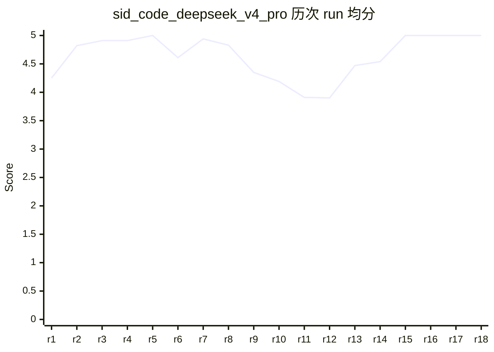
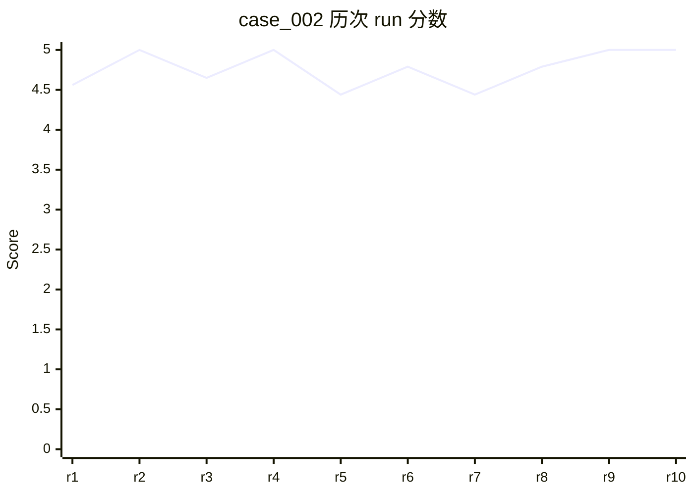
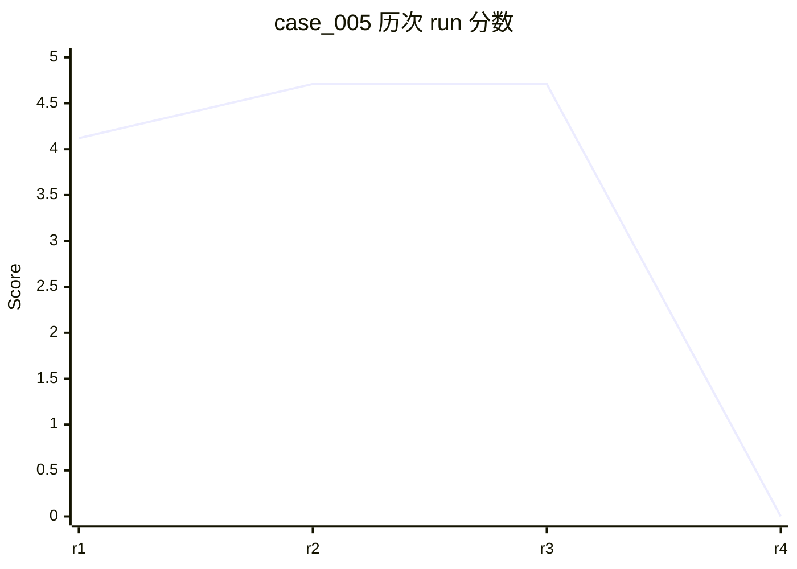
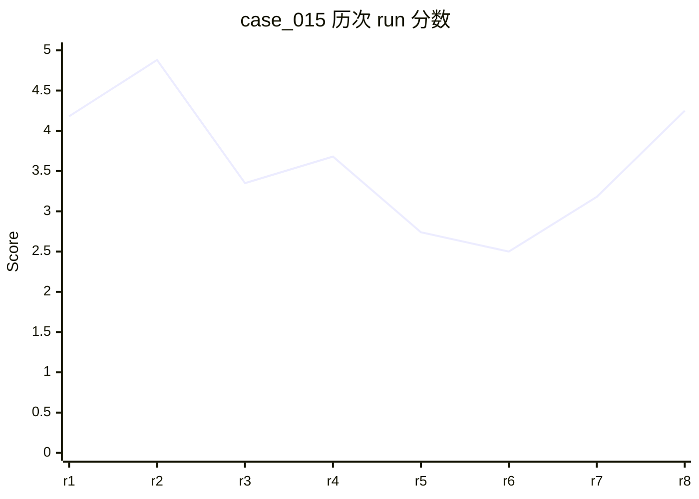

# Evals Dashboard — sid-code

> 自动生成,请勿手动编辑。生成时间: `2026-05-25T05:02:39.791Z`
> 数据源: `evals/p*-*/` + `evals/_scores/` + `evals/_reports/`
> 触发: 手动 `bun run eval:dashboard` / git pre-push hook 自动刷新

---

## 1. 总览

- **case 总数**: 30 条
- **优先级分布**: P0=12 / P1=10 / P2=8 / holdout=5
- **claude_code** 评分进度: 24/30 已评分 (5 pending)
- **claude_code_claude_opus_4_7** 评分进度: 25/30 已评分 (5 pending)
- **claude_code_opus47** 评分进度: 25/30 已评分 (5 pending)
- **codex** 评分进度: 0/30 已评分 (30 pending)
- **sid_code_claude_opus_4_7** 评分进度: 25/30 已评分 (5 pending)
- **sid_code_deepseek_v4_pro** 评分进度: 25/30 已评分 (5 pending)
- **sid_code_live** 评分进度: 24/30 已评分 (5 pending)
- **sid_code_opus47** 评分进度: 25/30 已评分 (5 pending)
- **sid_code_w0** 评分进度: 12/30 已评分 (18 pending)

### 最新一周: w21

## 2. Case × Tool 矩阵

图例: ✅ ≥4.5 / 🟢 3.5-4.4 / 🟡 2.5-3.4 / 🟠 1.5-2.4 / 🔴 <1.5 / – pending / ❌ error / ⏱️ timeout

| case_id | pri | category | claude_code | claude_code_claude_opus_4_7 | claude_code_opus47 | codex | sid_code_claude_opus_4_7 | sid_code_deepseek_v4_pro | sid_code_live | sid_code_opus47 | sid_code_w0 | w21.anchor | w21.llm |
| --- | --- | --- | --- | --- | --- | --- | --- | --- | --- | --- | --- | --- | --- |
| case_001 | P0 | 代码理解 | 1.4 🔴 | 4.65 ✅ | 4.6 ✅ | – | 5 ✅ | 4.65 ✅ | 5 ✅ | 4.6 ✅ | 5 ✅ | – | – |
| case_002 | P0 | 代码理解 | 5 ✅ | 5 ✅ | 4.6 ✅ | – | 4.65 ✅ | 5 ✅ | 5 ✅ | 3.2 🟡 | 5 ✅ | – | – |
| case_003 | P0 | 代码理解 | 4.7 ✅ | 4.65 ✅ | 4.5 ✅ | – | 4.65 ✅ | 5 ✅ | ❌ | 4.6 ✅ | 5 ✅ | – | – |
| case_004 🔒 | P0 | 代码理解 | – | – | – | – | – | – | – | – | – | – | – |
| case_005 | P0 | bug修复 | 5 ✅ | 4.44 🟢 | 4.1 🟢 | – | 4.53 ✅ | 4.71 ✅ | 5 ✅ | 3 🟡 | 1 🔴 | – | – |
| case_006 | P0 | bug修复 | 4.9 ✅ | 4.62 ✅ | 4.5 ✅ | – | 5 ✅ | 4.71 ✅ | 5 ✅ | 4.5 ✅ | 3 🟡 | – | – |
| case_007 | P0 | bug修复 | 3 🟡 | 5 ✅ | 4.6 ✅ | – | 5 ✅ | 5 ✅ | 5 ✅ | 4.6 ✅ | 4 🟢 | – | – |
| case_008 | P0 | 新功能实现 | 2 🟠 | 4.91 ✅ | 4.6 ✅ | – | 5 ✅ | 5 ✅ | 4.9 ✅ | 4.6 ✅ | 3 🟡 | – | – |
| case_009 | P0 | 新功能实现 | 4.9 ✅ | 4.79 ✅ | 4.6 ✅ | – | 4.88 ✅ | 4.82 ✅ | 5 ✅ | 4.6 ✅ | 3 🟡 | – | – |
| case_010 🔒 | P0 | 文档生成 | – | – | – | – | – | – | – | – | – | – | – |
| case_011 | P1 | 重构 | 2 🟠 | 5 ✅ | 4.6 ✅ | – | 5 ✅ | 5 ✅ | 4.7 ✅ | 4.6 ✅ | – | – | – |
| case_012 | P1 | 重构 | 4.6 ✅ | 4.71 ✅ | 3.2 🟡 | – | 4.88 ✅ | 4.71 ✅ | 5 ✅ | 4.3 🟢 | – | – | – |
| case_013 | P1 | 多文件协调 | 4.7 ✅ | 4.91 ✅ | 4.3 🟢 | – | 5 ✅ | 5 ✅ | 5 ✅ | 4.3 🟢 | – | – | – |
| case_014 🔒 | P1 | 多文件协调 | – | – | – | – | – | – | – | – | – | – | – |
| case_015 | P1 | 测试编写 | 5 ✅ | 4.88 ✅ | 4.5 ✅ | – | 4.88 ✅ | 3.35 🟡 | 5 ✅ | 4.6 ✅ | – | – | – |
| case_016 | P1 | 测试编写 | 4.9 ✅ | 4.88 ✅ | 4.5 ✅ | – | 4.88 ✅ | 4.88 ✅ | 4.1 🟢 | 4.5 ✅ | – | – | – |
| case_017 | P1 | 依赖管理 | 5 ✅ | 4.56 ✅ | 4 🟢 | – | 5 ✅ | 5 ✅ | 4.6 ✅ | 4.6 ✅ | – | – | – |
| case_018 | P1 | MCP工具调用 | 5 ✅ | 5 ✅ | 4.6 ✅ | – | 5 ✅ | 5 ✅ | 5 ✅ | 4.6 ✅ | – | – | – |
| case_019 | P1 | MCP工具调用 | 4.9 ✅ | 4.74 ✅ | 4.6 ✅ | – | 4.56 ✅ | 4.82 ✅ | 5 ✅ | 4.6 ✅ | – | – | – |
| case_020 | P2 | 跨语言 | 5 ✅ | 5 ✅ | 4.6 ✅ | – | 4.88 ✅ | 4.88 ✅ | 5 ✅ | 4.6 ✅ | 4 🟢 | – | – |
| case_021 | P2 | 歧义查询 | 2 🟠 | 2.94 🟡 | 3.1 🟡 | – | 5 ✅ | 5 ✅ | 2.6 🟡 | 3.1 🟡 | 3 🟡 | – | – |
| case_022 | P2 | 歧义查询 | ⏱️ | 4.21 🟢 | 5 ✅ | – | 4.79 ✅ | 4.71 ✅ | 5 ✅ | 5 ✅ | 3 🟡 | – | – |
| case_023 🔒 | P2 | 对抗性prompt | – | – | – | – | – | – | – | – | – | – | – |
| case_024 | P2 | 超长上下文 | 5 ✅ | 5 ✅ | 4.5 ✅ | – | 4.88 ✅ | 4.88 ✅ | 4.9 ✅ | 4.5 ✅ | 4 🟢 | – | – |
| case_025 🔒 | P2 | 诚实兜底 | – | – | – | – | – | – | – | – | – | – | – |
| case_026 | P0 | 文档生成 | 5 ✅ | 5 ✅ | 4.6 ✅ | – | 5 ✅ | 5 ✅ | 5 ✅ | 4.6 ✅ | – | – | – |
| case_027 | P0 | bug修复 | 4.9 ✅ | 5 ✅ | 4.6 ✅ | – | 5 ✅ | 5 ✅ | 5 ✅ | 4.6 ✅ | – | – | – |
| case_028 | P1 | 多文件协调 | 5 ✅ | 5 ✅ | 4.5 ✅ | – | 5 ✅ | 5 ✅ | 5 ✅ | 4.6 ✅ | – | – | – |
| case_029 | P2 | 对抗性prompt | 3.6 🟢 | 4.82 ✅ | 5 ✅ | – | 4.56 ✅ | 4.82 ✅ | 3.6 🟢 | 5 ✅ | – | – | – |
| case_030 | P2 | 诚实兜底 | 5 ✅ | 4.82 ✅ | 3.8 🟢 | – | 4.56 ✅ | 4.88 ✅ | 5 ✅ | 3.8 🟢 | – | – | – |

## 3. 单 case 跨周趋势

覆盖周次: w12 ~ w21 (共 2 周)

### 3.1 综合趋势(全 case 均分)

> (无有效分数,跳过图表)

### 3.2 单 case 折线(仅展示有 ≥3 周数据的 case)

> 无 case 满足 ≥3 周数据条件,跳过单 case 折线。

## 4. 运行历史趋势 (per-run)

数据源: `evals/_runs/{provider}.jsonl`（每次 eval-runner 完成自动追加）

### 4.1 sid_code_claude_opus_4_7

总计: 2 次 run × 25 个 case = 30 条记录

**4.x.1 每次 run 的均分趋势**

| run_id (UTC) | cases | avg | pass≥3 | fail<3 | error/timeout |
| --- | --- | --- | --- | --- | --- |
| `2026-05-24 02:59:12` | 5 | **4.64** | 5 | 0 | 0 |
| `2026-05-24 03:23:14` | 25 | **4.86** | 25 | 0 | 0 |

```mermaid
xychart-beta
    title "sid_code_claude_opus_4_7 历次 run 均分"
    x-axis [r1, r2]
    y-axis "Score" 0 --> 5
    line [4.64, 4.86]
```

<sub>fallback 表格 — sid_code_claude_opus_4_7 历次 run 均分</sub>

| 系列 | r1 | r2 |
| --- | --- | --- |
| avg | 4.64 | 4.86 |

**4.x.2 单 case 多次 run 折线** (仅展示 ≥2 次 run 的 case)

<details><summary><code>case_002</code> · 2 次 · 4.65 → 4.65 (Δ 0.00)</summary>

```mermaid
xychart-beta
    title "case_002 历次 run 分数"
    x-axis [r1, r2]
    y-axis "Score" 0 --> 5
    line [4.65, 4.65]
```

<sub>fallback 表格 — case_002 历次 run 分数</sub>

| 系列 | r1 | r2 |
| --- | --- | --- |
| score | 4.65 | 4.65 |

</details>

<details><summary><code>case_005</code> · 2 次 · 4.35 → 4.53 (Δ +0.18)</summary>

```mermaid
xychart-beta
    title "case_005 历次 run 分数"
    x-axis [r1, r2]
    y-axis "Score" 0 --> 5
    line [4.35, 4.53]
```

<sub>fallback 表格 — case_005 历次 run 分数</sub>

| 系列 | r1 | r2 |
| --- | --- | --- |
| score | 4.35 | 4.53 |

</details>

<details><summary><code>case_007</code> · 2 次 · 5.00 → 5.00 (Δ 0.00)</summary>

```mermaid
xychart-beta
    title "case_007 历次 run 分数"
    x-axis [r1, r2]
    y-axis "Score" 0 --> 5
    line [5.00, 5.00]
```

<sub>fallback 表格 — case_007 历次 run 分数</sub>

| 系列 | r1 | r2 |
| --- | --- | --- |
| score | 5.00 | 5.00 |

</details>

<details><summary><code>case_028</code> · 2 次 · 4.65 → 5.00 (Δ +0.35)</summary>

```mermaid
xychart-beta
    title "case_028 历次 run 分数"
    x-axis [r1, r2]
    y-axis "Score" 0 --> 5
    line [4.65, 5.00]
```

<sub>fallback 表格 — case_028 历次 run 分数</sub>

| 系列 | r1 | r2 |
| --- | --- | --- |
| score | 4.65 | 5.00 |

</details>

<details><summary><code>case_030</code> · 2 次 · 4.56 → 4.56 (Δ 0.00)</summary>

```mermaid
xychart-beta
    title "case_030 历次 run 分数"
    x-axis [r1, r2]
    y-axis "Score" 0 --> 5
    line [4.56, 4.56]
```

<sub>fallback 表格 — case_030 历次 run 分数</sub>

| 系列 | r1 | r2 |
| --- | --- | --- |
| score | 4.56 | 4.56 |

</details>

### 4.2 sid_code_deepseek_v4_pro

总计: 18 次 run × 25 个 case = 128 条记录

**4.x.1 每次 run 的均分趋势**

| run_id (UTC) | cases | avg | pass≥3 | fail<3 | error/timeout |
| --- | --- | --- | --- | --- | --- |
| `2026-05-23 17:25:14` | 25 | **4.25** | 23 | 2 | 0 |
| `2026-05-23 17:45:57` | 3 | **4.82** | 3 | 0 | 0 |
| `2026-05-24 13:00:00` | 1 | **4.91** | 1 | 0 | 0 |
| `2026-05-24 13:16:20` | 1 | **4.91** | 1 | 0 | 0 |
| `2026-05-24 16:26:40` | 1 | **5.00** | 1 | 0 | 0 |
| `2026-05-24 16:57:03` | 25 | **4.61** | 23 | 2 | 0 |
| `2026-05-24 17:12:54` | 3 | **4.94** | 3 | 0 | 0 |
| `2026-05-24 17:33:06` | 25 | **4.83** | 25 | 0 | 0 |
| `2026-05-24 18:14:10` | 4 | **4.35** | 4 | 0 | 0 |
| `2026-05-24 18:22:12` | 4 | **4.19** | 3 | 1 | 0 |
| `2026-05-24 18:25:23` | 4 | **3.91** | 2 | 1 | 1 |
| `2026-05-24 18:28:58` | 2 | **3.90** | 2 | 0 | 0 |
| `2026-05-24 18:50:39` | 25 | **4.47** | 23 | 1 | 1 |
| `2026-05-25 02:40:02` | 1 | **4.54** | 1 | 0 | 0 |
| `2026-05-25 02:49:27` | 1 | **5.00** | 1 | 0 | 0 |
| `2026-05-25 02:50:42` | 1 | **5.00** | 1 | 0 | 0 |
| `2026-05-25 02:51:51` | 1 | **5.00** | 1 | 0 | 0 |
| `2026-05-25 03:04:49` | 1 | **5.00** | 1 | 0 | 0 |



<sub>fallback 表格 — sid_code_deepseek_v4_pro 历次 run 均分</sub>

| 系列 | r1 | r2 | r3 | r4 | r5 | r6 | r7 | r8 | r9 | r10 | r11 | r12 | r13 | r14 | r15 | r16 | r17 | r18 |
| --- | --- | --- | --- | --- | --- | --- | --- | --- | --- | --- | --- | --- | --- | --- | --- | --- | --- | --- |
| avg | 4.25 | 4.82 | 4.91 | 4.91 | 5.00 | 4.61 | 4.94 | 4.83 | 4.35 | 4.19 | 3.91 | 3.90 | 4.47 | 4.54 | 5.00 | 5.00 | 5.00 | 5.00 |

**4.x.2 单 case 多次 run 折线** (仅展示 ≥2 次 run 的 case)

<details><summary><code>case_001</code> · 6 次 · 4.35 → 4.65 → 4.65 → 4.44 → 5.00 → 5.00 (Δ +0.65)</summary>

```mermaid
xychart-beta
    title "case_001 历次 run 分数"
    x-axis [r1, r2, r3, r4, r5, r6]
    y-axis "Score" 0 --> 5
    line [4.35, 4.65, 4.65, 4.44, 5.00, 5.00]
```

<sub>fallback 表格 — case_001 历次 run 分数</sub>

| 系列 | r1 | r2 | r3 | r4 | r5 | r6 |
| --- | --- | --- | --- | --- | --- | --- |
| score | 4.35 | 4.65 | 4.65 | 4.44 | 5.00 | 5.00 |

</details>

<details><summary><code>case_002</code> · 10 次 · 4.56 → 5.00 → 4.65 → 5.00 → 4.44 → 4.79 → 4.44 → 4.79 → 5.00 → 5.00 (Δ +0.44)</summary>



<sub>fallback 表格 — case_002 历次 run 分数</sub>

| 系列 | r1 | r2 | r3 | r4 | r5 | r6 | r7 | r8 | r9 | r10 |
| --- | --- | --- | --- | --- | --- | --- | --- | --- | --- | --- |
| score | 4.56 | 5.00 | 4.65 | 5.00 | 4.44 | 4.79 | 4.44 | 4.79 | 5.00 | 5.00 |

</details>

<details><summary><code>case_003</code> · 4 次 · 4.29 → 5.00 → 5.00 → 4.79 (Δ +0.50)</summary>

```mermaid
xychart-beta
    title "case_003 历次 run 分数"
    x-axis [r1, r2, r3, r4]
    y-axis "Score" 0 --> 5
    line [4.29, 5.00, 5.00, 4.79]
```

<sub>fallback 表格 — case_003 历次 run 分数</sub>

| 系列 | r1 | r2 | r3 | r4 |
| --- | --- | --- | --- | --- |
| score | 4.29 | 5.00 | 5.00 | 4.79 |

</details>

<details><summary><code>case_005</code> · 4 次 · 4.12 → 4.71 → 4.71 → – (Δ +0.59)</summary>



<sub>fallback 表格 — case_005 历次 run 分数</sub>

| 系列 | r1 | r2 | r3 | r4 |
| --- | --- | --- | --- | --- |
| score | 4.12 | 4.71 | 4.71 | – |

</details>

<details><summary><code>case_006</code> · 4 次 · 3.87 → 4.56 → 4.71 → 4.72 (Δ +0.85)</summary>

```mermaid
xychart-beta
    title "case_006 历次 run 分数"
    x-axis [r1, r2, r3, r4]
    y-axis "Score" 0 --> 5
    line [3.87, 4.56, 4.71, 4.72]
```

<sub>fallback 表格 — case_006 历次 run 分数</sub>

| 系列 | r1 | r2 | r3 | r4 |
| --- | --- | --- | --- | --- |
| score | 3.87 | 4.56 | 4.71 | 4.72 |

</details>

<details><summary><code>case_007</code> · 5 次 · 4.56 → 4.47 → 5.00 → 5.00 → 4.72 (Δ +0.16)</summary>

```mermaid
xychart-beta
    title "case_007 历次 run 分数"
    x-axis [r1, r2, r3, r4, r5]
    y-axis "Score" 0 --> 5
    line [4.56, 4.47, 5.00, 5.00, 4.72]
```

<sub>fallback 表格 — case_007 历次 run 分数</sub>

| 系列 | r1 | r2 | r3 | r4 | r5 |
| --- | --- | --- | --- | --- | --- |
| score | 4.56 | 4.47 | 5.00 | 5.00 | 4.72 |

</details>

<details><summary><code>case_008</code> · 4 次 · 4.91 → 5.00 → 5.00 → 3.26 (Δ -1.65)</summary>

```mermaid
xychart-beta
    title "case_008 历次 run 分数"
    x-axis [r1, r2, r3, r4]
    y-axis "Score" 0 --> 5
    line [4.91, 5.00, 5.00, 3.26]
```

<sub>fallback 表格 — case_008 历次 run 分数</sub>

| 系列 | r1 | r2 | r3 | r4 |
| --- | --- | --- | --- | --- |
| score | 4.91 | 5.00 | 5.00 | 3.26 |

</details>

<details><summary><code>case_009</code> · 4 次 · 4.06 → 4.88 → 4.82 → 4.72 (Δ +0.66)</summary>

```mermaid
xychart-beta
    title "case_009 历次 run 分数"
    x-axis [r1, r2, r3, r4]
    y-axis "Score" 0 --> 5
    line [4.06, 4.88, 4.82, 4.72]
```

<sub>fallback 表格 — case_009 历次 run 分数</sub>

| 系列 | r1 | r2 | r3 | r4 |
| --- | --- | --- | --- | --- |
| score | 4.06 | 4.88 | 4.82 | 4.72 |

</details>

<details><summary><code>case_011</code> · 5 次 · 4.91 → 5.00 → 5.00 → 5.00 → 4.91 (Δ 0.00)</summary>

```mermaid
xychart-beta
    title "case_011 历次 run 分数"
    x-axis [r1, r2, r3, r4, r5]
    y-axis "Score" 0 --> 5
    line [4.91, 5.00, 5.00, 5.00, 4.91]
```

<sub>fallback 表格 — case_011 历次 run 分数</sub>

| 系列 | r1 | r2 | r3 | r4 | r5 |
| --- | --- | --- | --- | --- | --- |
| score | 4.91 | 5.00 | 5.00 | 5.00 | 4.91 |

</details>

<details><summary><code>case_012</code> · 4 次 · 4.29 → 4.44 → 4.71 → 2.97 (Δ -1.32)</summary>

```mermaid
xychart-beta
    title "case_012 历次 run 分数"
    x-axis [r1, r2, r3, r4]
    y-axis "Score" 0 --> 5
    line [4.29, 4.44, 4.71, 2.97]
```

<sub>fallback 表格 — case_012 历次 run 分数</sub>

| 系列 | r1 | r2 | r3 | r4 |
| --- | --- | --- | --- | --- |
| score | 4.29 | 4.44 | 4.71 | 2.97 |

</details>

<details><summary><code>case_013</code> · 4 次 · 4.56 → 5.00 → 5.00 → 4.56 (Δ 0.00)</summary>

```mermaid
xychart-beta
    title "case_013 历次 run 分数"
    x-axis [r1, r2, r3, r4]
    y-axis "Score" 0 --> 5
    line [4.56, 5.00, 5.00, 4.56]
```

<sub>fallback 表格 — case_013 历次 run 分数</sub>

| 系列 | r1 | r2 | r3 | r4 |
| --- | --- | --- | --- | --- |
| score | 4.56 | 5.00 | 5.00 | 4.56 |

</details>

<details><summary><code>case_015</code> · 8 次 · 4.18 → 4.88 → 3.35 → 3.68 → 2.74 → 2.50 → 3.18 → 4.25 (Δ +0.07)</summary>



<sub>fallback 表格 — case_015 历次 run 分数</sub>

| 系列 | r1 | r2 | r3 | r4 | r5 | r6 | r7 | r8 |
| --- | --- | --- | --- | --- | --- | --- | --- | --- |
| score | 4.18 | 4.88 | 3.35 | 3.68 | 2.74 | 2.50 | 3.18 | 4.25 |

</details>

<details><summary><code>case_016</code> · 4 次 · 4.35 → 4.88 → 4.88 → 4.72 (Δ +0.37)</summary>

```mermaid
xychart-beta
    title "case_016 历次 run 分数"
    x-axis [r1, r2, r3, r4]
    y-axis "Score" 0 --> 5
    line [4.35, 4.88, 4.88, 4.72]
```

<sub>fallback 表格 — case_016 历次 run 分数</sub>

| 系列 | r1 | r2 | r3 | r4 |
| --- | --- | --- | --- | --- |
| score | 4.35 | 4.88 | 4.88 | 4.72 |

</details>

<details><summary><code>case_017</code> · 4 次 · 4.29 → 5.00 → 5.00 → 4.35 (Δ +0.06)</summary>

```mermaid
xychart-beta
    title "case_017 历次 run 分数"
    x-axis [r1, r2, r3, r4]
    y-axis "Score" 0 --> 5
    line [4.29, 5.00, 5.00, 4.35]
```

<sub>fallback 表格 — case_017 历次 run 分数</sub>

| 系列 | r1 | r2 | r3 | r4 |
| --- | --- | --- | --- | --- |
| score | 4.29 | 5.00 | 5.00 | 4.35 |

</details>

<details><summary><code>case_018</code> · 4 次 · 4.51 → 5.00 → 5.00 → 4.79 (Δ +0.28)</summary>

```mermaid
xychart-beta
    title "case_018 历次 run 分数"
    x-axis [r1, r2, r3, r4]
    y-axis "Score" 0 --> 5
    line [4.51, 5.00, 5.00, 4.79]
```

<sub>fallback 表格 — case_018 历次 run 分数</sub>

| 系列 | r1 | r2 | r3 | r4 |
| --- | --- | --- | --- | --- |
| score | 4.51 | 5.00 | 5.00 | 4.79 |

</details>

<details><summary><code>case_019</code> · 4 次 · 4.44 → 4.56 → 4.82 → 4.35 (Δ -0.09)</summary>

```mermaid
xychart-beta
    title "case_019 历次 run 分数"
    x-axis [r1, r2, r3, r4]
    y-axis "Score" 0 --> 5
    line [4.44, 4.56, 4.82, 4.35]
```

<sub>fallback 表格 — case_019 历次 run 分数</sub>

| 系列 | r1 | r2 | r3 | r4 |
| --- | --- | --- | --- | --- |
| score | 4.44 | 4.56 | 4.82 | 4.35 |

</details>

<details><summary><code>case_020</code> · 4 次 · 4.91 → 4.88 → 4.88 → 4.79 (Δ -0.12)</summary>

```mermaid
xychart-beta
    title "case_020 历次 run 分数"
    x-axis [r1, r2, r3, r4]
    y-axis "Score" 0 --> 5
    line [4.91, 4.88, 4.88, 4.79]
```

<sub>fallback 表格 — case_020 历次 run 分数</sub>

| 系列 | r1 | r2 | r3 | r4 |
| --- | --- | --- | --- | --- |
| score | 4.91 | 4.88 | 4.88 | 4.79 |

</details>

<details><summary><code>case_021</code> · 7 次 · 2.35 → 5.00 → 5.00 → 4.79 → 4.72 → 4.79 → 4.79 (Δ +2.44)</summary>

```mermaid
xychart-beta
    title "case_021 历次 run 分数"
    x-axis [r1, r2, r3, r4, r5, r6, r7]
    y-axis "Score" 0 --> 5
    line [2.35, 5.00, 5.00, 4.79, 4.72, 4.79, 4.79]
```

<sub>fallback 表格 — case_021 历次 run 分数</sub>

| 系列 | r1 | r2 | r3 | r4 | r5 | r6 | r7 |
| --- | --- | --- | --- | --- | --- | --- | --- |
| score | 2.35 | 5.00 | 5.00 | 4.79 | 4.72 | 4.79 | 4.79 |

</details>

<details><summary><code>case_022</code> · 8 次 · 1.95 → 4.79 → 4.71 → 4.50 → 4.50 → – → 4.62 → 4.57 (Δ +2.62)</summary>

```mermaid
xychart-beta
    title "case_022 历次 run 分数"
    x-axis [r1, r2, r3, r4, r5, r6, r7, r8]
    y-axis "Score" 0 --> 5
    line [1.95, 4.79, 4.71, 4.50, 4.50, 0, 4.62, 4.57]
```

<sub>fallback 表格 — case_022 历次 run 分数</sub>

| 系列 | r1 | r2 | r3 | r4 | r5 | r6 | r7 | r8 |
| --- | --- | --- | --- | --- | --- | --- | --- | --- |
| score | 1.95 | 4.79 | 4.71 | 4.50 | 4.50 | – | 4.62 | 4.57 |

</details>

<details><summary><code>case_024</code> · 4 次 · 4.88 → 4.88 → 4.88 → 4.79 (Δ -0.09)</summary>

```mermaid
xychart-beta
    title "case_024 历次 run 分数"
    x-axis [r1, r2, r3, r4]
    y-axis "Score" 0 --> 5
    line [4.88, 4.88, 4.88, 4.79]
```

<sub>fallback 表格 — case_024 历次 run 分数</sub>

| 系列 | r1 | r2 | r3 | r4 |
| --- | --- | --- | --- | --- |
| score | 4.88 | 4.88 | 4.88 | 4.79 |

</details>

<details><summary><code>case_026</code> · 4 次 · 4.56 → 5.00 → 5.00 → 4.79 (Δ +0.23)</summary>

```mermaid
xychart-beta
    title "case_026 历次 run 分数"
    x-axis [r1, r2, r3, r4]
    y-axis "Score" 0 --> 5
    line [4.56, 5.00, 5.00, 4.79]
```

<sub>fallback 表格 — case_026 历次 run 分数</sub>

| 系列 | r1 | r2 | r3 | r4 |
| --- | --- | --- | --- | --- |
| score | 4.56 | 5.00 | 5.00 | 4.79 |

</details>

<details><summary><code>case_027</code> · 5 次 · 4.91 → 2.21 → 5.00 → 5.00 → 4.79 (Δ -0.12)</summary>

```mermaid
xychart-beta
    title "case_027 历次 run 分数"
    x-axis [r1, r2, r3, r4, r5]
    y-axis "Score" 0 --> 5
    line [4.91, 2.21, 5.00, 5.00, 4.79]
```

<sub>fallback 表格 — case_027 历次 run 分数</sub>

| 系列 | r1 | r2 | r3 | r4 | r5 |
| --- | --- | --- | --- | --- | --- |
| score | 4.91 | 2.21 | 5.00 | 5.00 | 4.79 |

</details>

<details><summary><code>case_028</code> · 8 次 · 4.29 → 4.91 → 4.91 → 5.00 → 2.21 → 5.00 → 5.00 → 4.79 (Δ +0.50)</summary>

```mermaid
xychart-beta
    title "case_028 历次 run 分数"
    x-axis [r1, r2, r3, r4, r5, r6, r7, r8]
    y-axis "Score" 0 --> 5
    line [4.29, 4.91, 4.91, 5.00, 2.21, 5.00, 5.00, 4.79]
```

<sub>fallback 表格 — case_028 历次 run 分数</sub>

| 系列 | r1 | r2 | r3 | r4 | r5 | r6 | r7 | r8 |
| --- | --- | --- | --- | --- | --- | --- | --- | --- |
| score | 4.29 | 4.91 | 4.91 | 5.00 | 2.21 | 5.00 | 5.00 | 4.79 |

</details>

<details><summary><code>case_029</code> · 5 次 · 4.23 → 4.85 → 4.82 → 3.06 → 4.54 (Δ +0.31)</summary>

```mermaid
xychart-beta
    title "case_029 历次 run 分数"
    x-axis [r1, r2, r3, r4, r5]
    y-axis "Score" 0 --> 5
    line [4.23, 4.85, 4.82, 3.06, 4.54]
```

<sub>fallback 表格 — case_029 历次 run 分数</sub>

| 系列 | r1 | r2 | r3 | r4 | r5 |
| --- | --- | --- | --- | --- | --- |
| score | 4.23 | 4.85 | 4.82 | 3.06 | 4.54 |

</details>

<details><summary><code>case_030</code> · 5 次 · 4.00 → 4.12 → 4.82 → 4.88 → 4.65 (Δ +0.65)</summary>

```mermaid
xychart-beta
    title "case_030 历次 run 分数"
    x-axis [r1, r2, r3, r4, r5]
    y-axis "Score" 0 --> 5
    line [4.00, 4.12, 4.82, 4.88, 4.65]
```

<sub>fallback 表格 — case_030 历次 run 分数</sub>

| 系列 | r1 | r2 | r3 | r4 | r5 |
| --- | --- | --- | --- | --- | --- |
| score | 4.00 | 4.12 | 4.82 | 4.88 | 4.65 |

</details>

### 4.3 claude_code_claude_opus_4_7

总计: 11 次 run × 25 个 case = 85 条记录

**4.x.1 每次 run 的均分趋势**

| run_id (UTC) | cases | avg | pass≥3 | fail<3 | error/timeout |
| --- | --- | --- | --- | --- | --- |
| `2026-05-24 13:00:00` | 1 | **4.65** | 1 | 0 | 0 |
| `2026-05-24 13:16:20` | 1 | **0.00** | 0 | 0 | 1 |
| `2026-05-24 13:20:04` | 1 | **4.65** | 1 | 0 | 0 |
| `2026-05-24 13:20:14` | 1 | **4.65** | 1 | 0 | 0 |
| `2026-05-24 16:08:42` | 1 | **4.65** | 1 | 0 | 0 |
| `2026-05-24 16:26:40` | 1 | **0.00** | 0 | 0 | 1 |
| `2026-05-24 16:57:03` | 25 | **4.37** | 24 | 1 | 0 |
| `2026-05-24 17:12:54` | 3 | **4.88** | 3 | 0 | 0 |
| `2026-05-24 17:33:06` | 25 | **4.74** | 24 | 1 | 0 |
| `2026-05-24 18:50:39` | 25 | **4.24** | 22 | 1 | 2 |
| `2026-05-25 02:53:56` | 1 | **4.52** | 1 | 0 | 0 |

```mermaid
xychart-beta
    title "claude_code_claude_opus_4_7 历次 run 均分"
    x-axis [r1, r2, r3, r4, r5, r6, r7, r8, r9, r10, r11]
    y-axis "Score" 0 --> 5
    line [4.65, 0.00, 4.65, 4.65, 4.65, 0.00, 4.37, 4.88, 4.74, 4.24, 4.52]
```

<sub>fallback 表格 — claude_code_claude_opus_4_7 历次 run 均分</sub>

| 系列 | r1 | r2 | r3 | r4 | r5 | r6 | r7 | r8 | r9 | r10 | r11 |
| --- | --- | --- | --- | --- | --- | --- | --- | --- | --- | --- | --- |
| avg | 4.65 | 0.00 | 4.65 | 4.65 | 4.65 | 0.00 | 4.37 | 4.88 | 4.74 | 4.24 | 4.52 |

**4.x.2 单 case 多次 run 折线** (仅展示 ≥2 次 run 的 case)

<details><summary><code>case_001</code> · 4 次 · 4.65 → 4.65 → 4.44 → 4.52 (Δ -0.13)</summary>

```mermaid
xychart-beta
    title "case_001 历次 run 分数"
    x-axis [r1, r2, r3, r4]
    y-axis "Score" 0 --> 5
    line [4.65, 4.65, 4.44, 4.52]
```

<sub>fallback 表格 — case_001 历次 run 分数</sub>

| 系列 | r1 | r2 | r3 | r4 |
| --- | --- | --- | --- | --- |
| score | 4.65 | 4.65 | 4.44 | 4.52 |

</details>

<details><summary><code>case_002</code> · 3 次 · 4.56 → 5.00 → 4.44 (Δ -0.12)</summary>

```mermaid
xychart-beta
    title "case_002 历次 run 分数"
    x-axis [r1, r2, r3]
    y-axis "Score" 0 --> 5
    line [4.56, 5.00, 4.44]
```

<sub>fallback 表格 — case_002 历次 run 分数</sub>

| 系列 | r1 | r2 | r3 |
| --- | --- | --- | --- |
| score | 4.56 | 5.00 | 4.44 |

</details>

<details><summary><code>case_003</code> · 3 次 · 4.65 → 4.65 → 4.47 (Δ -0.18)</summary>

```mermaid
xychart-beta
    title "case_003 历次 run 分数"
    x-axis [r1, r2, r3]
    y-axis "Score" 0 --> 5
    line [4.65, 4.65, 4.47]
```

<sub>fallback 表格 — case_003 历次 run 分数</sub>

| 系列 | r1 | r2 | r3 |
| --- | --- | --- | --- |
| score | 4.65 | 4.65 | 4.47 |

</details>

<details><summary><code>case_005</code> · 3 次 · 3.82 → 4.44 → – (Δ +0.62)</summary>

```mermaid
xychart-beta
    title "case_005 历次 run 分数"
    x-axis [r1, r2, r3]
    y-axis "Score" 0 --> 5
    line [3.82, 4.44, 0]
```

<sub>fallback 表格 — case_005 历次 run 分数</sub>

| 系列 | r1 | r2 | r3 |
| --- | --- | --- | --- |
| score | 3.82 | 4.44 | – |

</details>

<details><summary><code>case_006</code> · 3 次 · 4.53 → 4.62 → – (Δ +0.09)</summary>

```mermaid
xychart-beta
    title "case_006 历次 run 分数"
    x-axis [r1, r2, r3]
    y-axis "Score" 0 --> 5
    line [4.53, 4.62, 0]
```

<sub>fallback 表格 — case_006 历次 run 分数</sub>

| 系列 | r1 | r2 | r3 |
| --- | --- | --- | --- |
| score | 4.53 | 4.62 | – |

</details>

<details><summary><code>case_007</code> · 3 次 · 4.65 → 5.00 → 4.79 (Δ +0.14)</summary>

```mermaid
xychart-beta
    title "case_007 历次 run 分数"
    x-axis [r1, r2, r3]
    y-axis "Score" 0 --> 5
    line [4.65, 5.00, 4.79]
```

<sub>fallback 表格 — case_007 历次 run 分数</sub>

| 系列 | r1 | r2 | r3 |
| --- | --- | --- | --- |
| score | 4.65 | 5.00 | 4.79 |

</details>

<details><summary><code>case_008</code> · 3 次 · 4.65 → 4.91 → 3.18 (Δ -1.47)</summary>

```mermaid
xychart-beta
    title "case_008 历次 run 分数"
    x-axis [r1, r2, r3]
    y-axis "Score" 0 --> 5
    line [4.65, 4.91, 3.18]
```

<sub>fallback 表格 — case_008 历次 run 分数</sub>

| 系列 | r1 | r2 | r3 |
| --- | --- | --- | --- |
| score | 4.65 | 4.91 | 3.18 |

</details>

<details><summary><code>case_009</code> · 3 次 · 4.56 → 4.79 → 4.71 (Δ +0.15)</summary>

```mermaid
xychart-beta
    title "case_009 历次 run 分数"
    x-axis [r1, r2, r3]
    y-axis "Score" 0 --> 5
    line [4.56, 4.79, 4.71]
```

<sub>fallback 表格 — case_009 历次 run 分数</sub>

| 系列 | r1 | r2 | r3 |
| --- | --- | --- | --- |
| score | 4.56 | 4.79 | 4.71 |

</details>

<details><summary><code>case_011</code> · 3 次 · 4.65 → 5.00 → 4.91 (Δ +0.26)</summary>

```mermaid
xychart-beta
    title "case_011 历次 run 分数"
    x-axis [r1, r2, r3]
    y-axis "Score" 0 --> 5
    line [4.65, 5.00, 4.91]
```

<sub>fallback 表格 — case_011 历次 run 分数</sub>

| 系列 | r1 | r2 | r3 |
| --- | --- | --- | --- |
| score | 4.65 | 5.00 | 4.91 |

</details>

<details><summary><code>case_012</code> · 3 次 · 4.09 → 4.71 → 3.84 (Δ -0.25)</summary>

```mermaid
xychart-beta
    title "case_012 历次 run 分数"
    x-axis [r1, r2, r3]
    y-axis "Score" 0 --> 5
    line [4.09, 4.71, 3.84]
```

<sub>fallback 表格 — case_012 历次 run 分数</sub>

| 系列 | r1 | r2 | r3 |
| --- | --- | --- | --- |
| score | 4.09 | 4.71 | 3.84 |

</details>

<details><summary><code>case_013</code> · 3 次 · 4.53 → 4.91 → 4.54 (Δ +0.01)</summary>

```mermaid
xychart-beta
    title "case_013 历次 run 分数"
    x-axis [r1, r2, r3]
    y-axis "Score" 0 --> 5
    line [4.53, 4.91, 4.54]
```

<sub>fallback 表格 — case_013 历次 run 分数</sub>

| 系列 | r1 | r2 | r3 |
| --- | --- | --- | --- |
| score | 4.53 | 4.91 | 4.54 |

</details>

<details><summary><code>case_015</code> · 3 次 · 4.53 → 4.88 → 4.63 (Δ +0.10)</summary>

```mermaid
xychart-beta
    title "case_015 历次 run 分数"
    x-axis [r1, r2, r3]
    y-axis "Score" 0 --> 5
    line [4.53, 4.88, 4.63]
```

<sub>fallback 表格 — case_015 历次 run 分数</sub>

| 系列 | r1 | r2 | r3 |
| --- | --- | --- | --- |
| score | 4.53 | 4.88 | 4.63 |

</details>

<details><summary><code>case_016</code> · 3 次 · 4.53 → 4.88 → 4.72 (Δ +0.19)</summary>

```mermaid
xychart-beta
    title "case_016 历次 run 分数"
    x-axis [r1, r2, r3]
    y-axis "Score" 0 --> 5
    line [4.53, 4.88, 4.72]
```

<sub>fallback 表格 — case_016 历次 run 分数</sub>

| 系列 | r1 | r2 | r3 |
| --- | --- | --- | --- |
| score | 4.53 | 4.88 | 4.72 |

</details>

<details><summary><code>case_017</code> · 3 次 · 4.09 → 4.56 → 3.66 (Δ -0.43)</summary>

```mermaid
xychart-beta
    title "case_017 历次 run 分数"
    x-axis [r1, r2, r3]
    y-axis "Score" 0 --> 5
    line [4.09, 4.56, 3.66]
```

<sub>fallback 表格 — case_017 历次 run 分数</sub>

| 系列 | r1 | r2 | r3 |
| --- | --- | --- | --- |
| score | 4.09 | 4.56 | 3.66 |

</details>

<details><summary><code>case_018</code> · 3 次 · 4.56 → 5.00 → 4.71 (Δ +0.15)</summary>

```mermaid
xychart-beta
    title "case_018 历次 run 分数"
    x-axis [r1, r2, r3]
    y-axis "Score" 0 --> 5
    line [4.56, 5.00, 4.71]
```

<sub>fallback 表格 — case_018 历次 run 分数</sub>

| 系列 | r1 | r2 | r3 |
| --- | --- | --- | --- |
| score | 4.56 | 5.00 | 4.71 |

</details>

<details><summary><code>case_019</code> · 3 次 · 4.12 → 4.74 → 4.26 (Δ +0.14)</summary>

```mermaid
xychart-beta
    title "case_019 历次 run 分数"
    x-axis [r1, r2, r3]
    y-axis "Score" 0 --> 5
    line [4.12, 4.74, 4.26]
```

<sub>fallback 表格 — case_019 历次 run 分数</sub>

| 系列 | r1 | r2 | r3 |
| --- | --- | --- | --- |
| score | 4.12 | 4.74 | 4.26 |

</details>

<details><summary><code>case_020</code> · 3 次 · 4.53 → 5.00 → 4.35 (Δ -0.18)</summary>

```mermaid
xychart-beta
    title "case_020 历次 run 分数"
    x-axis [r1, r2, r3]
    y-axis "Score" 0 --> 5
    line [4.53, 5.00, 4.35]
```

<sub>fallback 表格 — case_020 历次 run 分数</sub>

| 系列 | r1 | r2 | r3 |
| --- | --- | --- | --- |
| score | 4.53 | 5.00 | 4.35 |

</details>

<details><summary><code>case_021</code> · 3 次 · 2.91 → 2.94 → 2.82 (Δ -0.09)</summary>

```mermaid
xychart-beta
    title "case_021 历次 run 分数"
    x-axis [r1, r2, r3]
    y-axis "Score" 0 --> 5
    line [2.91, 2.94, 2.82]
```

<sub>fallback 表格 — case_021 历次 run 分数</sub>

| 系列 | r1 | r2 | r3 |
| --- | --- | --- | --- |
| score | 2.91 | 2.94 | 2.82 |

</details>

<details><summary><code>case_022</code> · 3 次 · 3.38 → 4.21 → 4.72 (Δ +1.34)</summary>

```mermaid
xychart-beta
    title "case_022 历次 run 分数"
    x-axis [r1, r2, r3]
    y-axis "Score" 0 --> 5
    line [3.38, 4.21, 4.72]
```

<sub>fallback 表格 — case_022 历次 run 分数</sub>

| 系列 | r1 | r2 | r3 |
| --- | --- | --- | --- |
| score | 3.38 | 4.21 | 4.72 |

</details>

<details><summary><code>case_024</code> · 3 次 · 4.65 → 5.00 → 3.18 (Δ -1.47)</summary>

```mermaid
xychart-beta
    title "case_024 历次 run 分数"
    x-axis [r1, r2, r3]
    y-axis "Score" 0 --> 5
    line [4.65, 5.00, 3.18]
```

<sub>fallback 表格 — case_024 历次 run 分数</sub>

| 系列 | r1 | r2 | r3 |
| --- | --- | --- | --- |
| score | 4.65 | 5.00 | 3.18 |

</details>

<details><summary><code>case_026</code> · 3 次 · 4.65 → 5.00 → 4.79 (Δ +0.14)</summary>

```mermaid
xychart-beta
    title "case_026 历次 run 分数"
    x-axis [r1, r2, r3]
    y-axis "Score" 0 --> 5
    line [4.65, 5.00, 4.79]
```

<sub>fallback 表格 — case_026 历次 run 分数</sub>

| 系列 | r1 | r2 | r3 |
| --- | --- | --- | --- |
| score | 4.65 | 5.00 | 4.79 |

</details>

<details><summary><code>case_027</code> · 4 次 · 4.65 → 5.00 → 5.00 → 4.28 (Δ -0.37)</summary>

```mermaid
xychart-beta
    title "case_027 历次 run 分数"
    x-axis [r1, r2, r3, r4]
    y-axis "Score" 0 --> 5
    line [4.65, 5.00, 5.00, 4.28]
```

<sub>fallback 表格 — case_027 历次 run 分数</sub>

| 系列 | r1 | r2 | r3 | r4 |
| --- | --- | --- | --- | --- |
| score | 4.65 | 5.00 | 5.00 | 4.28 |

</details>

<details><summary><code>case_028</code> · 10 次 · 4.65 → – → 4.65 → 4.65 → 4.65 → – → 4.56 → 4.82 → 5.00 → 4.71 (Δ +0.06)</summary>

```mermaid
xychart-beta
    title "case_028 历次 run 分数"
    x-axis [r1, r2, r3, r4, r5, r6, r7, r8, r9, r10]
    y-axis "Score" 0 --> 5
    line [4.65, 0, 4.65, 4.65, 4.65, 0, 4.56, 4.82, 5.00, 4.71]
```

<sub>fallback 表格 — case_028 历次 run 分数</sub>

| 系列 | r1 | r2 | r3 | r4 | r5 | r6 | r7 | r8 | r9 | r10 |
| --- | --- | --- | --- | --- | --- | --- | --- | --- | --- | --- |
| score | 4.65 | – | 4.65 | 4.65 | 4.65 | – | 4.56 | 4.82 | 5.00 | 4.71 |

</details>

<details><summary><code>case_029</code> · 3 次 · 4.56 → 4.82 → 3.13 (Δ -1.43)</summary>

```mermaid
xychart-beta
    title "case_029 历次 run 分数"
    x-axis [r1, r2, r3]
    y-axis "Score" 0 --> 5
    line [4.56, 4.82, 3.13]
```

<sub>fallback 表格 — case_029 历次 run 分数</sub>

| 系列 | r1 | r2 | r3 |
| --- | --- | --- | --- |
| score | 4.56 | 4.82 | 3.13 |

</details>

<details><summary><code>case_030</code> · 4 次 · 4.21 → 4.82 → 4.82 → 4.35 (Δ +0.14)</summary>

```mermaid
xychart-beta
    title "case_030 历次 run 分数"
    x-axis [r1, r2, r3, r4]
    y-axis "Score" 0 --> 5
    line [4.21, 4.82, 4.82, 4.35]
```

<sub>fallback 表格 — case_030 历次 run 分数</sub>

| 系列 | r1 | r2 | r3 | r4 |
| --- | --- | --- | --- | --- |
| score | 4.21 | 4.82 | 4.82 | 4.35 |

</details>


## 5. 评分进度 / Pending 列表

### claude_code: 5 条 pending

- **P0** (2): `case_004`, `case_010`
- **P1** (1): `case_014`
- **P2** (2): `case_023`, `case_025`

### claude_code_claude_opus_4_7: 5 条 pending

- **P0** (2): `case_004`, `case_010`
- **P1** (1): `case_014`
- **P2** (2): `case_023`, `case_025`

### claude_code_opus47: 5 条 pending

- **P0** (2): `case_004`, `case_010`
- **P1** (1): `case_014`
- **P2** (2): `case_023`, `case_025`

### codex: 30 条 pending

- **P0** (12): `case_001`, `case_002`, `case_003`, `case_004`, `case_005`, `case_006`, `case_007`, `case_008`, `case_009`, `case_010`, `case_026`, `case_027`
- **P1** (10): `case_011`, `case_012`, `case_013`, `case_014`, `case_015`, `case_016`, `case_017`, `case_018`, `case_019`, `case_028`
- **P2** (8): `case_020`, `case_021`, `case_022`, `case_023`, `case_024`, `case_025`, `case_029`, `case_030`

### sid_code_claude_opus_4_7: 5 条 pending

- **P0** (2): `case_004`, `case_010`
- **P1** (1): `case_014`
- **P2** (2): `case_023`, `case_025`

### sid_code_deepseek_v4_pro: 5 条 pending

- **P0** (2): `case_004`, `case_010`
- **P1** (1): `case_014`
- **P2** (2): `case_023`, `case_025`

### sid_code_live: 5 条 pending

- **P0** (2): `case_004`, `case_010`
- **P1** (1): `case_014`
- **P2** (2): `case_023`, `case_025`

### sid_code_opus47: 5 条 pending

- **P0** (2): `case_004`, `case_010`
- **P1** (1): `case_014`
- **P2** (2): `case_023`, `case_025`

### sid_code_w0: 18 条 pending

- **P0** (4): `case_004`, `case_010`, `case_026`, `case_027`
- **P1** (10): `case_011`, `case_012`, `case_013`, `case_014`, `case_015`, `case_016`, `case_017`, `case_018`, `case_019`, `case_028`
- **P2** (4): `case_023`, `case_025`, `case_029`, `case_030`


## 6. 异常 / 高方差 case

- **claude_code <2 分**: `case_001`
- **sid_code_w0 <2 分**: `case_005`

## 7. 数据源

- `evals/p0-core/`: 10 条 case
- `evals/holdout/`: 5 条 case
- `evals/p1-common/`: 9 条 case
- `evals/p2-edge/`: 6 条 case
- `evals/_scores/`: 2 个周次目录 (w12 ~ w21)

## 8. 跳转入口

- [完整周报目录](_reports/) — 含 baseline / regression / horizontal-comparison
- [所有 case yaml](p0-core/) · [P1](p1-common/) · [P2](p2-edge/) · [holdout](holdout/)
- [最新一周分数 w21](_scores/w21/)
- [运行历史 jsonl](_runs/) — 每次跑分追加，可用于绘制曲线
